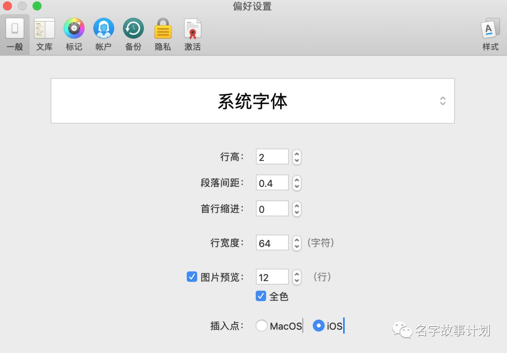
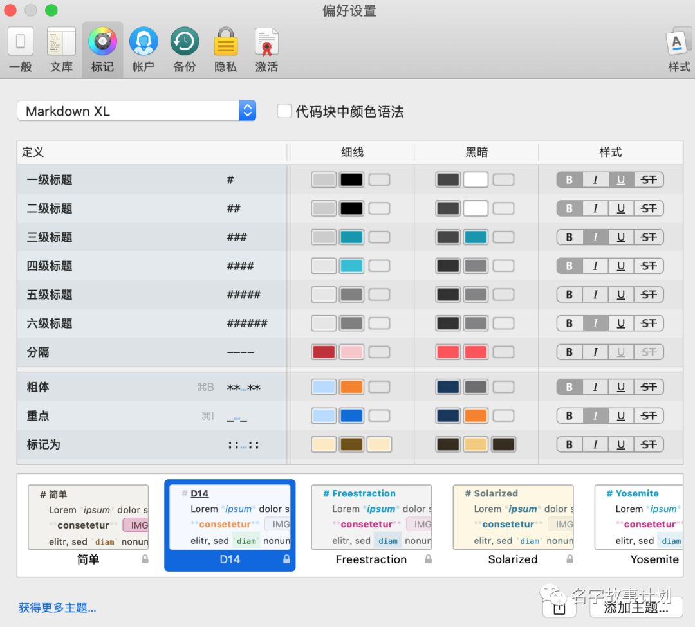
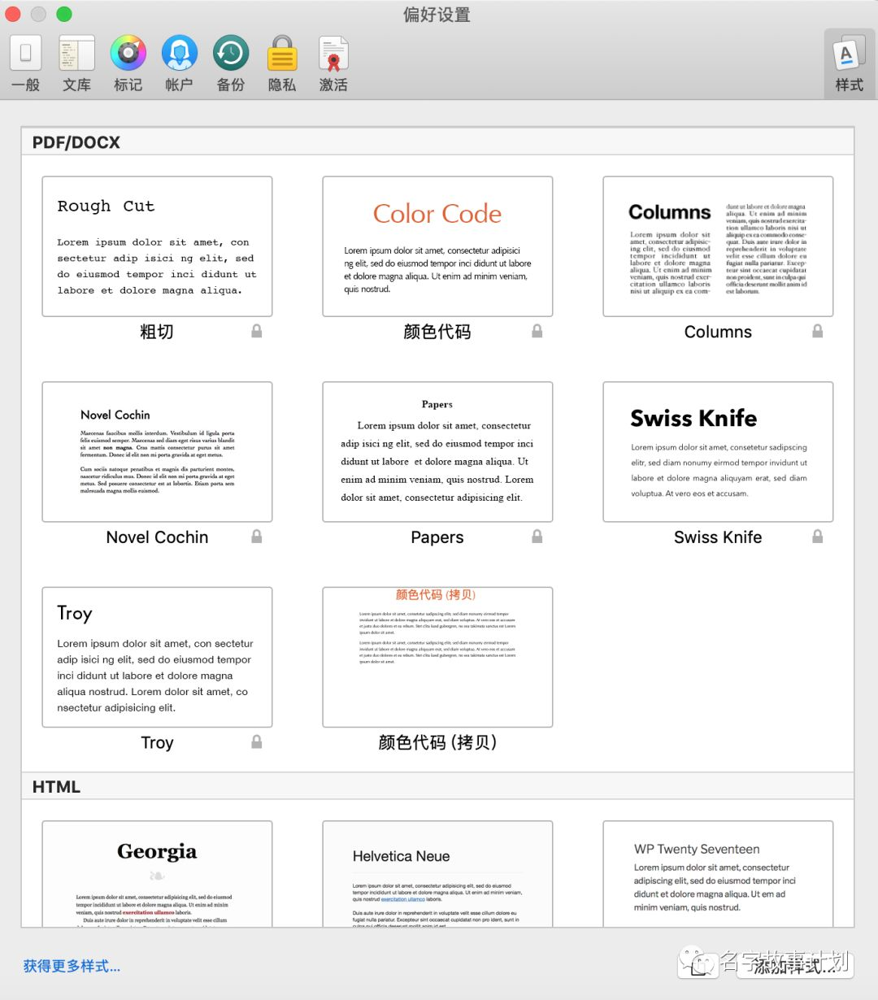
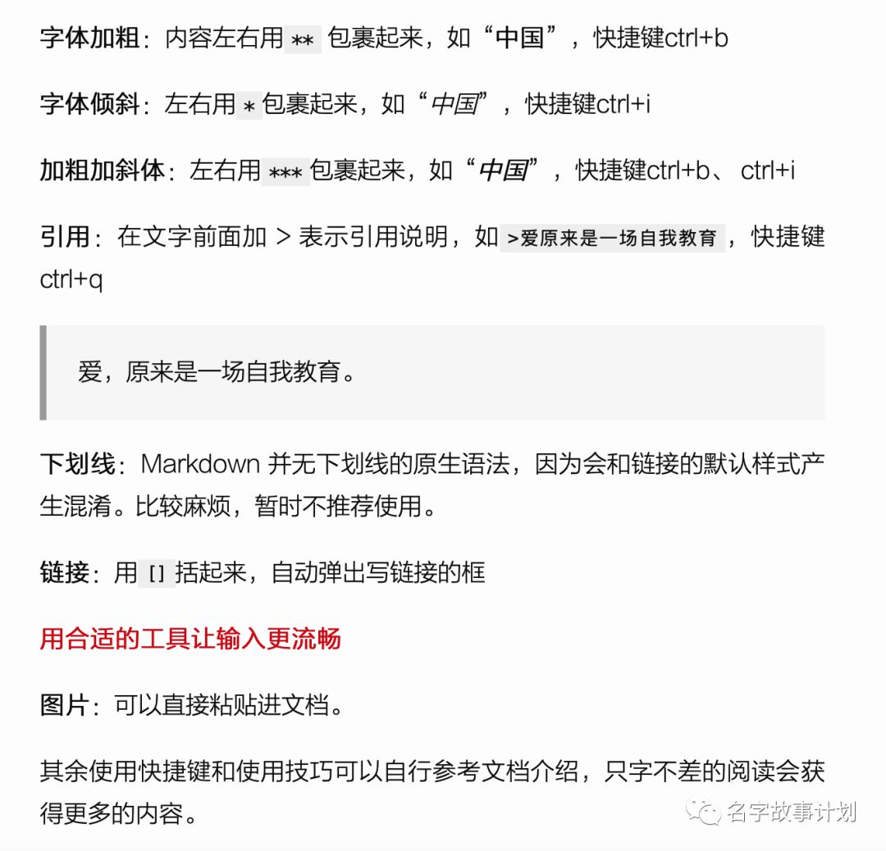
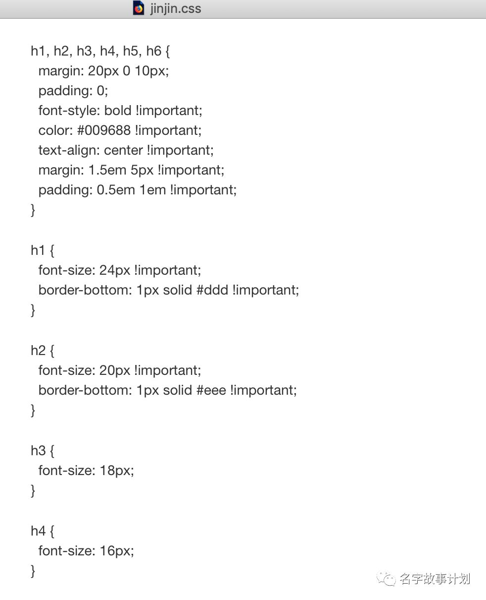
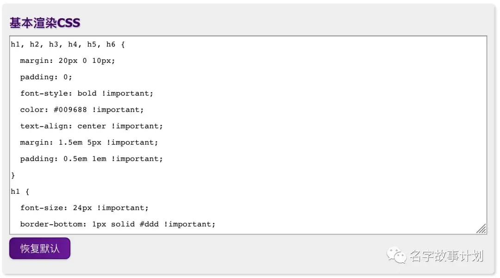

很多写作者已经知道Markdown写作的巨大优点了：

> 写完就意味着编辑完
> 让写作更顺畅
> 让写作更快速

Ulysses是我目前遇到过的最棒的Markdown写作神器，如何上手呢？
使用写作软件分两步：

> 1.设置行文样式
> 2.记得常用快捷键

## 常用快捷键

因为第一点比较关键，而大多数人有没有耐心去琢磨，我们先说第二点，关于主要快捷键的用法，这里列一下使用频次最高的。

**一级标题** ——“#+标题”

**二级标题** ——“##+标题”

**三级标题** ——“###+标题”

**四级标题** ——“####+标题”

**五级标题** ——“#####+标题”

**六级标题** ——“######+标题”

**无序列表** ：通过-加一个空格表示，后面跟内容，如：“- 北京”

- 北京
- 上海

**有序列表** ：数字+“.”+空格+内容来表示，如“1. 北京”

1. 北京
2. 上海
3. 广州

**字体加粗** ：内容左右用

```
**
```
包裹起来，如“ **中国** ”，快捷键ctrl+b

**字体倾斜** ：左右用

```
*
```
包裹起来，如“ *中国* ”，快捷键ctrl+i

**加粗加斜体** ：左右用

```
***
```
包裹起来，如“ ***中国*** ”，快捷键ctrl+b、 ctrl+i

**引用** ：在文字前面加 > 表示引用说明，如

```
>爱原来是一场自我教育
```
，快捷键ctrl+q

> 爱，原来是一场自我教育。

**下划线** ：Markdown 并无下划线的原生语法，因为会和链接的默认样式产生混淆。比较麻烦，暂时不推荐使用。

**链接** ：用

```
[]
```
括起来，自动弹出写链接的框

**图片** ：可以直接粘贴进文档。

其余使用快捷键和使用技巧可以自行参考文档介绍，只字不差的阅读会获得更多的内容。

## 设置样式

就是中文排版，李笑来老师说中文排版的重点只有三个：

> - 字体大小
> - 行间距
> - 字间距

字体大小通用就好，笑来老师用的是字体大小16px，行间距1.8倍，字间距0.1倍，倍数都是相对于字体大小而言。

还有段前和段后间距，都可以根据自己的兴趣设置。

关键是在Ulysses中如何设置这些基本样式呢？

在主页面Ulysses——偏好设置，会出现以下界面。



这个页面设置的是我们在Ulysses文档书写界面的排版，并不是输出的Markdown格式的排版样式。

点击上图中的 **标记** 窗口，显示的是设置Ulysses文档书写界面的主题，包含每种标题和特征的颜色、是否加粗、是否斜体、是否划线等等，这些特征主题都不是Markdown格式输出的排版样式，如下图。



我们想要的Markdown格式输出显示的样式设置，也就是最终所见效果的样式设置，点击上图中右上角的 **样式** 可以看到，如下图所示。



不同的格式，如PDF、DOCX、HTML、ePub有不同的输出样式，而这些样式都是有CSS这种格式文件所定义的。

所以，我们要么使用图中已有的样式库中的样式，要么自定义样式，因为已有的选择中，不一定能满足我们的习惯。

如本篇文章，用HTML中的Chinaese style样式，输出是这样的：



CSS中的内容是这样的：



图中的一部分就是定义六个级别的标题样式的代码，我是不懂编程和代码的，但是当我们深入学习进去，会发现，每一部分都是特定作用，也不难。随后会专门写一篇文章，写清楚每一项的含义。

而我比较喜欢笑来老师公众号文章的编辑样式，但是从输出的文章是看不到css文件的，好在笑来老师把他所常用的css样式分享在了GitHub上，这里贴出GitHub网址和笑来老师介绍Markdown here的公众号文章。

笑来老师所用css的GitHub网址:

> https://gist.github.com/aa190255b7dde302d10208ae247fc9f2

[Markdown Here 教程（这次是及格版）](https://mp.weixin.qq.com/s?__biz=MzAxNzI4MTMwMw==&mid=2651629983&idx=2&sn=749589cc7213c3e755fddeb210563815&scene=21#wechat_redirect)

把喜欢的css下载之后，可以进行编辑，改成自己喜欢的样式，然后从样式界面的 **添加样式** 功能，添加到样式库，就可以使用了。

## Markdown here

我们的文本编辑完成后，多数是要发表在平台上的，简书、微信公众号等等，但有的平台并不兼容Markdown格式，比如流量最大的自媒体平台微信公众号，这时我们要想把简介漂亮的Markdown样式在公众号的文章中呈现，就需要Markdown here来渲染了。

Markdown here是个浏览器插件，多用于邮件书写等不兼容Markdown格式的情景下，支持ChromeFirefoxSafari浏览器。

自己的Chrome浏览器一直无法下载安装，而Firefox浏览器安装流畅，这里推荐Firefox试试。

> 1.在Firefox浏览器中下载Markdown here插件，然后把插件拖到浏览器的窗口中。
>
> 2.在Firefox浏览器中，打开菜单——附加组件，找到Markdown here，点击首选项。
>
> 3.首选项页面中的 **基本渲染** 对话框中的css文件，就是我们可以进行渲染的文本样式。可以自定义不同的css文件，需要哪种，就把哪种css中的内容粘贴到 **基本渲染** 对话框中就行。如下图。
>
> 4.在Ulysses中书写文本。
>
> 5.拷贝粘贴到微信公众号的编辑器中。
>
> 6.使用Markdown here一键渲染。（插件安装成功后，浏览器的工具栏右侧会出现Markdown here的渲染按钮。）
>
> 7.插图图片，修订。
>
> 8.发布



**注意** ，在自定义css时，会出现设置的效果没能出现，这是因为优先级的问题，不同的地方对同一个特征进行不同的样式设置，出现矛盾，只能从一，所以笑来老师建议，在想要的设置后面加上“！important”，就像上图中的那样。

## 样式预览

在Ulysses中有样式预览，所以，如果我们在Ulysses中有和浏览器插件Markdown here中渲染所用的一样的css，就可以在写作时预览到公众号编辑渲染后呈现的样子，这个非常方便。
