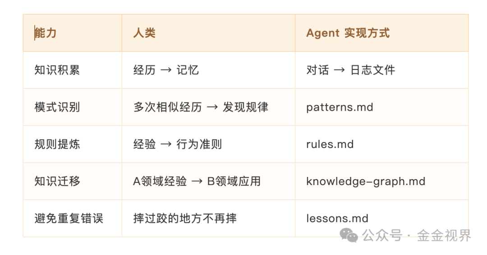

# Openclaw小龙虾助手会越来越聪明吗

原创 金金视界 金金视界 *2026年3月9日 07:30*

前几天我问了紫龙一个问题：”Agent能复刻一个人变得越来越聪明的过程吗？”

紫龙是我的一个Openclaw小龙虾Agent，他给了一张很有意思的表：

我发现他认为能做到的，他自己也还差得很远。

不过我挺认可他说的，因为我想到一个人从小长大的过程，能面对和处理的事情越来越多，很多地方挺类似的。

## 人是怎么变聪明的

上学或者学习任何一种技艺的过程都很能说明，就是模仿，练习，出错，改正，再练习。

有一个印象很深的同学，他把错题集做的非常好，错题集里的题都做的非常的熟练，考试效果非常好，虽然是应试，但就是做到了前位，更何况，生活中很多时候，其实也是应试。

一个人”变聪明了”，到底指什么？不是他记住了更多事实，而是他在面对新问题时，能更快地做出更好的判断。

本质上就四件事：

**第一，错误学习——从失败中改变行为**

这是起点，也是最值钱的。错题集有用，是因为做错之后改正了，下次遇到同类题，会了。

Ericsson 研究”刻意练习”也是这个结论：区分顶尖高手和普通人的，不是练习时长，而是有没有从每次错误中获得反馈并修正。没有反馈的重复，一万小时也是原地踏步。

**第二，主动反思——激发新的思考**

每天经历那么多事，大部分转头就忘。但如果你晚上花十分钟回顾”今天做对了什么、做错了什么、分别有什么样的体验”，那些零散的经历就被记录，反思会激发新的思考，长时间会变成新的认知。

学术界评估了 10 种常见学习方法，只有”主动回忆”（自己考自己）和”间隔重复”被评为最高效——而划重点、反复看笔记这些大家最爱用的方法，反而低效。

反思不完全等于主动回忆，但底层逻辑相通：都是逼自己主动加工信息，而不是被动接收。

**第三，模式识别——从规律中预判**

前两步让你积累了足够多的教训和反思，到这一步就开始质变了。

亏过几次之后，你不只是”记住了教训”，而是开始隐约感觉”每次市场疯狂喊 All in 的时候就该跑了”——你能在事情发生之前就预感到结果，这就是模式识别。

错误学习改变的是”过去的行为”，模式识别改变的是”未来的判断”。一个有投资经验的人比新手强在哪？不是知道更多消息，而是见过的模式更多，识别得更快。

**第四，知识结构化——建立概念之间的联系**

这是最高级的形态。我们读了塔勒布的反脆弱，又看了芒格的多元思维模型，突然发现”安全边际”和”反脆弱”说的好像是同一件事。这个连接一旦建立，两个孤立的知识点就变成了一个更强大的认知框架。

已知越多，新知识能链接的就越多，学起来越快、理解越深。这就是知识复利——网络越大，新节点的边际价值越高。

四件事是递进关系： **犯错纠正 → 反思提炼 → 识别模式 → 结构化连接** 。先改正错误，再总结经验，然后开始预判，最终形成自己的认知框架。

现在回头看初始化的Agent缺的就很清楚了：它不会从错误中改变行为（上次犯的错下次照犯），不会主动反思（没人逼它就不动），不会识别模式（每次对话都是全新的），更不会结构化连接（知识是孤立的）。

但好在他会很好的执行我们要让它做的事情。我们要做的就是告诉他，你要每日复盘，要提取经验，要反思错误，超级有价值的东西要优先记录等等。

## 我自己的实验：三层成长型记忆

我和紫龙聊完之后，他设计了一个更贴近人类成长逻辑的架构（可能也是参考市场上的方案），三层：

**底层是记录** ——每天的原始事件日志，流水账，什么都记。

**中层是提炼** ——从记录里总结出四样东西：犯过什么错（教训库）、发现了什么规律（模式库）、总结了什么准则（规则库）、知识之间有什么关联（知识图谱）。

**顶层是身份** ——价值观和核心原则，指导所有决策。

关键不是架构本身，而是主动反思机制——每天定时回顾当天对话，主动提取规律，总结教训，提炼准则。如果这个系统真能跑起来，理论上应该有复利效应：时间越长，提炼越精，价值越大。不过这个复利效应还有待验证。

## 市场上在做什么

带着这个思路去看市场，发现大家在努力解决Agent的记忆和进化问题。

创业公司方面，Mem0（$2400万融资）、Letta、Cognee、Zep 都在做 AI 记忆层，做法各有不同——自动冲突检测、知识图谱自进化、时序追踪。

但 Letta 团队有个有意思的发现： **简单的文件系统+好的Agent设计** ，效果就能超过很多花哨的框架，说明”怎么用记忆”比”用什么工具”更重要。

社区也已经有能直接装的很多Skills：自动写反思日记的、跨会话持久记忆的、自动发现笔记关联的，刚好对应前面说的四件事， **可以让你的小龙虾去搜Github上最火的，这就是他最擅长干的事儿，注意可以加一个安全监测的Agent** ，随意下载的风险还是挺大的。

早期Reflexion框架就是Agent任务失败后写个”反思笔记”，下次带着这个笔记重试，不改模型参数，效果就能明显提升。

今年两个重要进展：微软的 ERL 把经验直接”刻进”模型行为习惯（在特定测试中复杂任务提升 81%），MemRL用强化学习训练”怎么记最高效”（大脑不变，笔记术越来越强）。ICLR 今年也第一次为Agent记忆开了专门分会场——memory问题从小众变成了主流。

大的方向也很清晰：记忆要能自己学习怎么存取、要多维度索引、要形成自进化闭环。一句话：Agent 不只是在用记忆，而是在 **通过记忆成长** 。

### 回头审视我的三层架构

看完市场上这些，让Openclaw紫龙检测，发现三个改进点：

**规则要有”保质期”**
当前总结的一条模式，标着置信度”高”，如果三个月之后再没遇到类似场景验证过——它可能早就不准了，却还在指导决策。记忆应该越用越准，不用就褪色。比如 60 天没被验证过的模式，自动降权。

**要加闭环反馈**
规则用了之后效果怎么样？要追踪。好用的加强，出问题的迭代，不是写了就完了。

**反思不该只靠定时**
反思离错误越近，内化越好。犯错时立即记录，定时反思只做回顾和权重调整。

把这些交给Openclaw，让他自己融合进去了。

---

今天聊这个主要是自己想到了这个问题，再去市场上看解决方案，就清晰了很多。我也建议大家不要一上来就找最好的skills，没有最好。自己先简单用起来，过程中遇到问题，缺啥补啥，会理解更深。

## 我的结论

Agent会越来越聪明吗？我觉得会。但不是靠更大的模型，而是靠从”记忆机器”变成”学习系统”——能记住错误、能反思经验、能从中改进。

其实人也一样，每天花十分钟复盘，把犯过的错记下来，把发现的规律提炼出来，时间长了，这些东西会自己长出连接。

知识复利就是这样： **时间越长，价值越大。** 对人成立，对 AI 也成立。

---

今天给紫龙增加了一个子Agent，作为审核和改进，监督所有的任务流程执行情况。

也给紫龙写了一条更新规则，每周调研写一篇最新的Agent自我进化和成长的报告，对比自己的系统，进行优化。
