# 比特币多50%的定投方法—分区间定投概述

金金 金金视界 *2020年12月1日 16:03*

这个表是我自己执行的定投策略收益图。

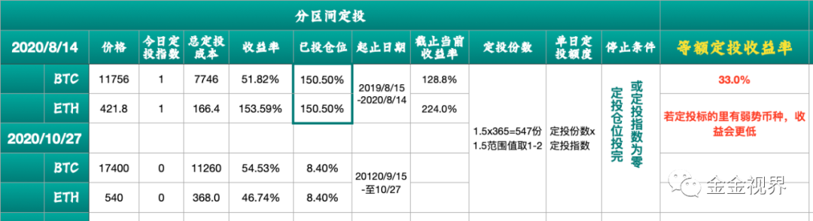

第一年度是从2019年8月15日-2020年8月14日，停止定投时，比特币和以太收益率分别为51.8%和153.59%。按照2020年12月1日的价格19500美元和610美元算，收益率达到了151.7%和266.5%。

第二年度是从2020年9月15日至2020年10月27日，比特币和以太收益率分别为54.53%和46.7%。按照2020年12月1日的价格19500美元和610美元算，收益率达到了73.1%和65.7%。

相比等额定投，分区间定投不仅仅提高了近20个点的收益率，我更看重的是在低位加了足够筹码，2019-2020年度，一共投出了预定份额的150%的量。

只有拿到足够多的低位筹码，在价格涨上去的时候，才不会被大波动影响心态，相当于早早的给自己在 **量和价** 上都建立了一道护城河，也就是证券分析之父本杰明·格雷厄姆所说的安全边际。

这个过程，社群里的朋友一起见证，每天投多少份额，都有在群里或者币乎微文有公布。

赶上今年的312，我在社群里一边加油打气，一边鼓励让大家10倍，8倍份额的买，随着行情越来越好，变成了5倍、3倍、2倍的买。

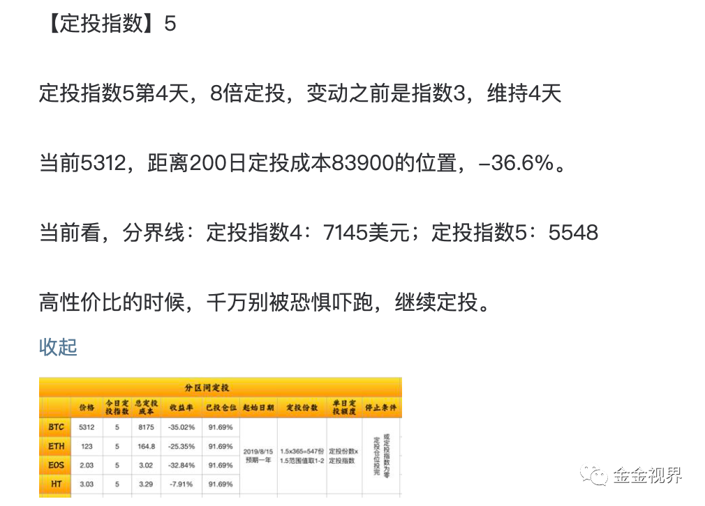
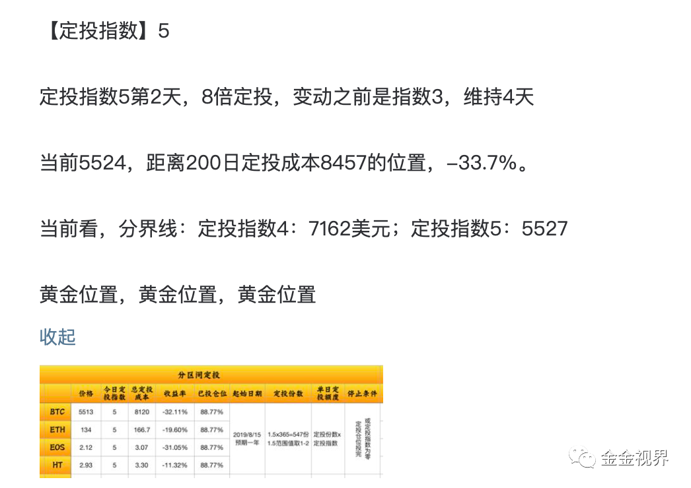

即使这样，我知道很多人并没有跟随策略，而是停止了定投，因为那种恐慌情绪下，下跌过程中，顶住越投越亏的直接反馈太反人性了。

接下来我们思考几个问题？这是我发现很多人都出现的情况。

为什么2020年312之后不敢买？为什么连一直坚持的定投都停了？
从17年过来，为什么熊市大趋势中从山腰投到山脚？
为什么这几年的小周期中，却总是定投着过山车？

这几个问题值得多数人深入思考，尤其是我们普通人，并不是一句“我要长期投资”能够回答的。

就像好友小飞，当年重仓币圈，高位变现对法币获得超高收益，如果不变现，而是坚持拿到现在，那他这三年来的心态可能会完全不一样，因为少了非常多的现金流，心态不稳的情况下就可能进行冲动操作，那不仅法币本位减少，币本位也很可能变少。

也就是说，长期的等额定投很好，但并不一定一直合适，如果用不好，会陷入很纠结的状态。

今天，从以下几个方面，说下我对定投的理解和优化策略，和大家交流：

**1\. 定投的目的**
**2\. 对定投策略的再认识**
**3\. 定投策略的特点及关键**
**4\. 量化思维——把策略落地可执行**
**5\. 不同定投策略的回测分析**
**6\. 策略优化——分区间定投**
**7\. 定投指数**
**8\. 现在什么时候**
**9\. 定投工具**
**10\. 关于定抛**

### 1、定投的目的

定投的定义很简单，定期定额买入某种标的。

那定投的目的到底是什么？

定投只是一种投资方式，定投的完整路径是定额定期买入筹码。

到筹码这儿就结束了，至于说筹码价格涨多高，不是我们能控制的。

如果说定投的标的我们有共识，比如说比特币。因为长期大家都是看涨的，那定投的终极目的，就是

就是在某个时间点以前，在风险尽量低的情况下获得尽量多的筹码。

不把这件事情搞清楚，说定投的目的是财富自由，这中间不知道隔了多少个坑和周期。

### 2、对定投策略的再认识

从字面上看，定投就是固定时间固定金额的投入。

如果只是这样持续，我认为它不适用于普通人，这个“不适用”指的是普通人要因此背负代价过大的成本。

定投的前提是标的长期来看是上涨的。

定投的比特币的目的就是 **在某个时间点以前，在风险尽量低的情况下获得尽量多的比特币** 。

这里的关键词：

> “某个时间点以前”
> “风险尽量低”
> “筹码尽量多”
> “形成共识的标的：比特币”

抽象出来，对应的是时间成本、赔率、资金成本、概率。

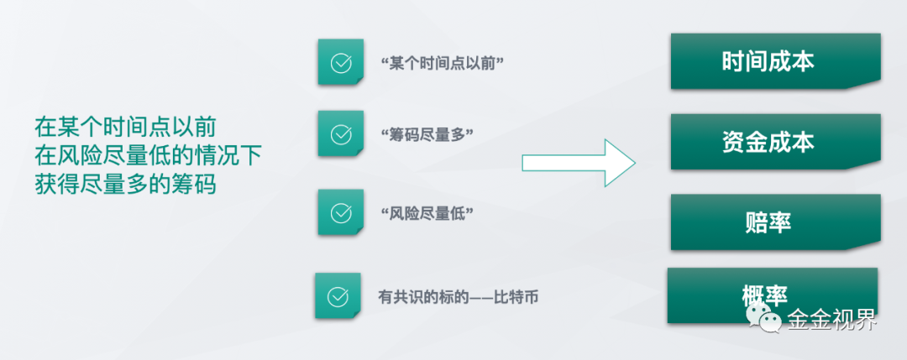

这几点是我们作为普通人要找到符合自己最合适的投资方式而必须综合考量的。

分别来看一下。

#### 资金成本

这是四个因素中我们唯一可以主动改变的因素，我们要非常努力才能获得更多的可拿来投资的资金。

如果我们有100元，能拿出来50元投资，和有1000元，拿出来50元投资，其使用成本是不一样的，这是量变带来质变的结果。

江南愤青陈宇在一次论坛分享中说：

> 如果有做项目的跟我说他们估值5亿，那就不谈了，如果他说估值几百万，那我们可以投个几十万过去，做成了，我们收益很高，因为赔率大，做不成，也就赔个几十万。

其实机构或者说资金力量雄厚的人和普通人最大的区别就在于此，他们有足够多的钱来试错，而普通人不行，资金有限是事实，所以我们必须考虑自己的资金量和买入成本，否则很难抗住一波又一波的市场的风险和人性的贪婪。

#### 时间成本

给自己3年时间，获得15倍资产的收益，这样的机会，在8090后的这一代，再难有了。

但是，即使三年，持续的投入，对于普通人来说都不容易，更别说长期无差别的持续投入，不仅是资金压力，还有心理压力，很少有人能淡定的面对从17年底定投到18年底的持续大跌，而持续定投。

普通人的机会少，试错成本更大，同样的时间，自身付出的代价更大。

这就需要考虑在不得不支出的时间成本下，如何获得更多的收益。

#### 赔率

赔率，就是收益和成本的比值。

比如：

你花1元钱买了某人赢，1:6的赔率指的是：如果你输了，你损失1元；如果你赢了，你赢5元、并且将你原先的1元钱拿回，总共拿回6元。

这个大家都懂，正因为我们资金量小，才必须追求赔率，否则怎么实现我们目标呢，不管什么标的，只有价格尽量低，赔率才可能尽量高。

低成本是控制风险和建立投资信心的关键。

#### 概率

如果不考虑实现的概率，以上所述“低时间成本内的高赔率”就是镜花水月。

考虑概率，减少不确定性，目的就是对抗市场中的巨大风险。

市场中的风险主要是客观的意外和主观的“骚操作”。

> 客观的意外：项目跑路或者失败，黑天鹅事件等。
>
> 主观的骚操作：意识不到错误，意识到了控制不住的错误操作，或者是基于狂热、自信、赌性、急于求成、侥幸、冲动、追求刺激等操作。

怎么应对呢？

具体来说就是：

**客观上** ，找那些大概率能成的标的，比如股市中的阿里和茅台，币市中的比特币，以太坊。
**主观上** ，只做那些降低风险的操作。

如果我们的主要仓位不是这两个，我认为是在赌一个小概率事件，不管一旦它做成了倍数有多大，乘以一个小概率，期望值也会降低很多。

到此你会发现两点：

定投，是个好方法。

但综合来看，仅仅无差别不分周期的长期定投比特币，效率太低，尤其是对普通人而言，我们付出的时间、资金甚至精力成本都太大，甚至难以承受。

更有甚者，定投的还不是比特币，而是其他山寨主流币，真的是有可能定投至死。

怎么办呢？先来看定投策略的特点。

### 3.定投策略的特点及关键

买入次数：多次
买入点：整段时间
风险：低
收益：相对低
操作实现的可能性：高

这时不知道大家有没有想起，另一种操作方法，找到低点一次抄底。

一次抄底的特点：

买入次数：单次
买入点：最低点
风险：高
收益：高
操作实现的可能性：极低

放在图上，就是这样的：

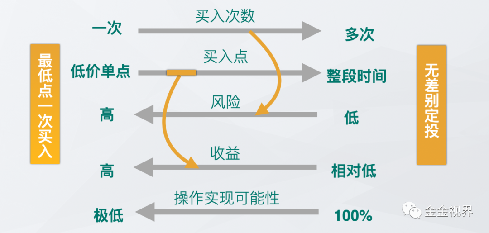

**定投策略的关键——风险和成本的平衡**

从图中可以看出，往往，同样的条件下，概率和赔率负相关，风险尽量低和成本尽量低是矛盾的。

先看一下两个因素处于极端条件下的情况：

##### 1)最低的风险，一定的成本

无差别定投属于这种：风险低、且可执行，在币圈，应该可以说无差别定投是最低风险的投资方式了。

##### 2)最低的成本，高风险

买在最低点：成本最低，理想化，但找到那一点，概率极低，执行起来难，风险高，但一旦找到赔率极高。

两种情况，就像是一条线段上的两个极端。

> \-买入的时机，从一个单点到整个时间段。
> \-获得收益，从很高到相对低。
> \-风险，从大到小。

这也呈现了一个事实：

> 在两个极端中间，有大片的空间让我们来综合平衡风险和成本，来优化我们的策略，获得更高收益。

所以我们的目标就聚焦到找到相对更优的解。

如上图所示，我的方法是用多次买入降低风险，即定投；用买不同额度在包含最低点的低位及相对低位的区域买入，来降低成本，即分区间。

综合起来，就得到我们的解决方案：在相对低位区间采取定投，在更好的位置投入更多的子弹获得的筹码。

比特傻说，在充分理解标的、市场、及历史价格之后之后，你的投资策略只比无脑定投出多两个东西：

> 1、周期底部时间段的模糊判断。
> 2、周期底部低点位置的模糊判断。

高度认同，作为普通人，如果又想抓住趋势，又想提高投资回报率，就要在定投策略的基础上，寻找更加合适的时间段，哪怕那是模糊的。模糊是一道门槛，正是模糊，帮你阻止了更多的竞争者。

探索市场的过程，就是追求模糊的正确的过程。

而正确的范围比精确的点更重要。

因为这样才有可行性。

那到底怎样才能把以上结论转换为可指导我们具体操作的落地策略呢？

这就提出一个关键词： **量化思维** 。

### 4\. 量化思维——把策略落地可执行

> 量化是从理论到执行的桥梁。

《数据化决策》这本书的作者哈伯德说：

> 量化的概念是‘减少不确定性’，而且没有必要完全消除不确定性。

这让我们聚焦于目标、实现这个目标最核心的衡量指标、以及这些该指标如何量化。

那在【分区间定投】这件事情上，需要量化的是什么呢？

**不同的区间划分、不同区间对应的定投份额、单份定投金额大小** 的确定。

第一个最为重要，即不同的区间划分。

> “做短期波段”和“不考虑任何情况的每日定投”是投资方式的两个极端，一个是非常的安全一个是相当的冒险，这个应该是大家都认可的前提。既然这是两个极端，那就有大片的中间地带，值得我们去探索。
>
> 趋势有周期，周期有顶底，顶底是范围，在长期这个条件下，很多指标随着时间的拉长，其表征意义的确定性大大增加，可把握的概率也大大增加。

也就是说，我们可以用一些大周期指标来判断行情所处的周期阶段。

为什么我能够在那个时候超额买？为什么应该在那个时候超额买？

以上就是答案，因为我让自己脱离感性的判断，用数据让理性战胜感性。

下面来用实例说明，区间划分的方法。

### 5、不同定投策略的对比分析

关于定投区间的选择，金金有一个选择体系，包含一些长期和中短期重要的行情判断指标。

这些指标综合使用，才能达到最好的效果。

今天用其中一个指标结合比特币的行情来说明定投区间划分的方法及重要性。

今天举例的这个指标，其思路最初是受九神启发，这个方法很有参考意义(当然，有很大的主观性)，这也是我实际定投的依据之一，以后金金会慢慢把同样的计算方法迁移到主流币种上，慢慢分享给大家。

现在开始回测。

#### 5.1 基于估值和200日定投成本的定投区间判定

**确定三个概念**

> \-比特币估值：指数增长估值，数据取得是网站ahr999.com的比特币拟合估值数据。
> \-200日定投成本：调和平均值
> \-比特币实际价格
>
> 比特币价格低于200日定投平均成本，意味着在这个时候买币，可以跑赢定投的人。
>
> 比特币价格低于指数增长模型的估值，意味着在这个时候，币价被低估了。

前者即BTC/200日定投成本<1，后者即BTC/估值价格<1。

所以，整个比特币走势可以分为四种情况：

\-A、BTC/200日定投成本<1，BTC/估值价格<1 -B、BTC/200日定投成本>1，BTC/估值价格<1 -C、BTC/200日定投成本<1，BTC/估值价格>1
\-D、BTC/200日定投成本>1，BTC/估值价格>1

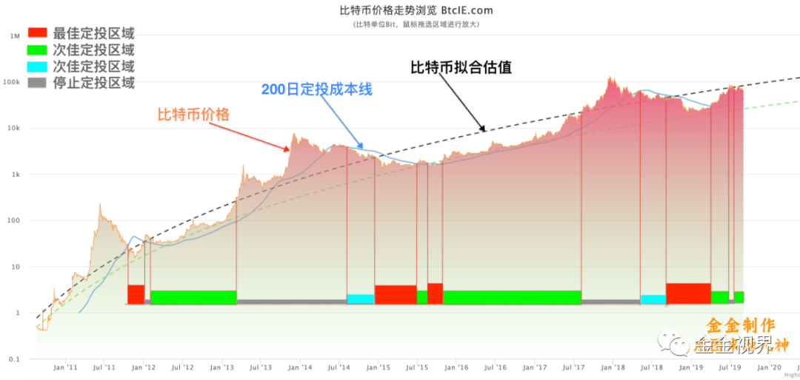

在A区间内直接买就好了；B、C区间内相对成本提高，但也可以买；D区间就不是好的买入区间了。

很显然，这种时买时不买的买进方法不属于严格意义上的定投，但目的是追求在成本相对低的那些区域买进，而对于普通人来说，成本相对低的这些区域也是一个漫长的时间段，所以，金金的办法就是，找到这些区域，然后在这些区域里进行定投。

A属于最好的定投区间，B、C属于次好的定投区间，D属于停止定投区间。

统计从2013年12月份高点之后的符合定投区域的区间如下：

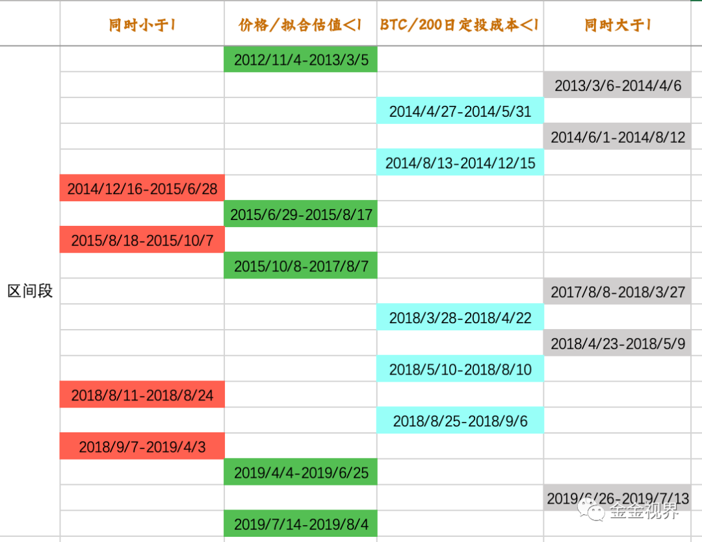

把这些区间在BTC走势图上标识出来，如下图。

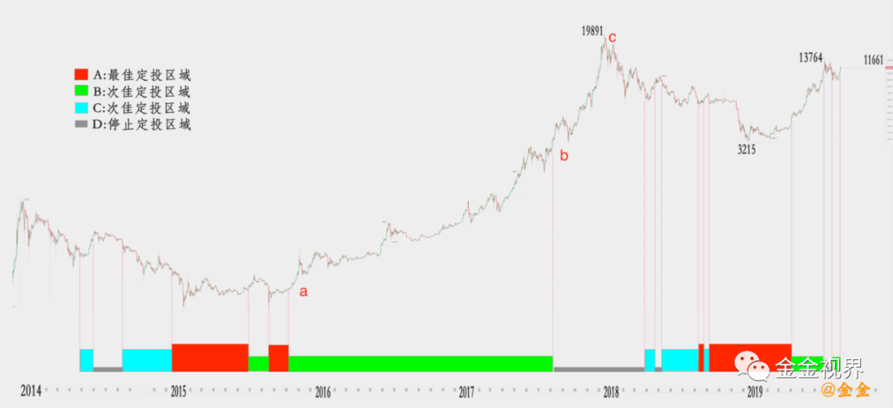

从图中可以看出，最佳定投区域几乎不多不少完全包括底部区域。同时在整个周期的高峰区域段停止定投。

因为比特币的价格涨幅太大，为了能够在尽量小的幅面中看到尽量大的价格增长幅度，这张图纵坐标使用的是对数表达，所以价格对比看起来没有那么夸张，有的小伙伴会疑惑为什么其中一段“次佳定投区域”到图中的b才结束，看起来成本已经很高了。

我们把从a到b到c这段区域，纵坐标去掉对数表达，用正常的数据表达，如下图：

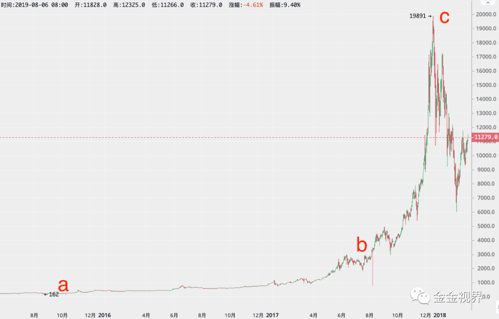

能够看出，按这种划分方法，定投的时候完全避过了价格高点区间段，会让我们定投成本降低不少。

**收益回测**

为了判断这种分区间定投方案的优劣，用具体的定投数字来回测收益。

条件：从2014年4月27日开始，到2019年8月4日，每天预定300元人民币，USDT按6.95计算。

定投方案一:

坚持每天定投300元，直到2019年8月4日。
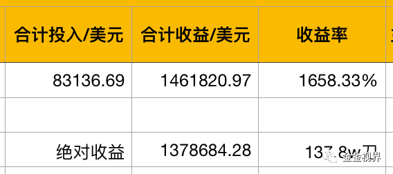

定投方案二：

坚持在最佳定投区间和次佳定投区间，每天定投300元，直到2019年8月4日。

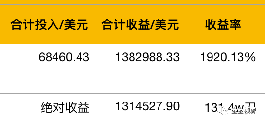

定投方案三：
坚持在最佳定投区间，每天定投300元，直到2019年8月4日。

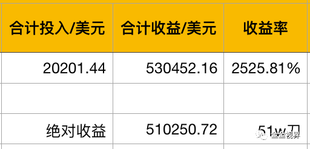

如果我们把总投入金额的绝对值取相等，都为第一种方案里的83136.69美元。对比如下：

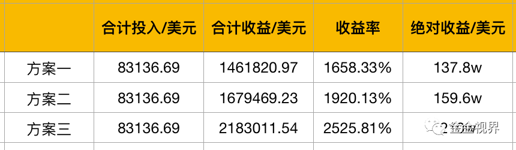

当然，这是最理想化的回测，理想的地方在于，对于未来我们不知道具体最佳和次佳定投区域具体占怎样的比例，所以我们无法判定具体应该分配多少原来不间断每日定投的资金到这些最佳和次佳定投时段上。

但是一个趋势应该是对的，即在更好的定投区间分配更多的资金。这是相对于你原计划每日定投金额来说的。

为了方便理解，制定了定投方案四进行回测。

定投方案四：

在最佳定投区间投入双倍的原定投金额，即600元，在次佳定投区间投入单份定投金额300元。

目的是让定投成本更低的时候获得更多的筹码，且定投方案具有可行性。
投入和收益情况如下：

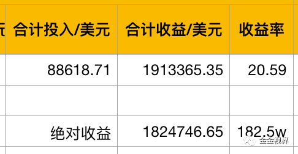

我们发现第四种定投方式，投入的总金额竟然和不间断每日定投的总金额差不多。但收益率却从1658%变成了2059%。

为了更好的对比，同样理想化的把总投入金额的绝对值取相等，都为第一种方案里的83136.69美元。对比如下：

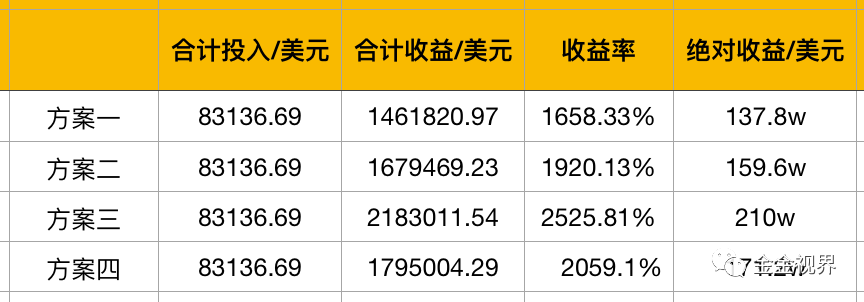

对比四种方案，可以看出，在更佳的定投区间投入更多的资金，获得的收益更高，即买在了更好的低位。

**剥离感性才能当下决策而不是事后大悟**

可能会有人认为，“在更佳的定投区间投入更多的资金，获得的收益更高”这个道理浅显易懂，都知道便宜的时候多买点，贵的时候少买点，到最后能赚的更多。

事实却不是这样的，如果知道就能达成，资本市场就不会只有20%甚至更少的人群赚钱了。从事后看，我们当然知道哪里买入更正确，但往往，市场里，身在此山中，身处那时刻，你我总是没能正确的决定正真的敢买入，在什么地方买入，用多少买入。

如果没有策略，那就是感性占主导，结果一定是，高位不敢卖，怕错过，低位不敢买，怕损失。这是与生俱来的趋利避害的人性，你我都有。

而一个适合自己的策略，就是把自己的感性因素剥离在外，甚至可以把其他众人的情绪变化放在策略里，反向指导。

好的策略就像一个包含了不同尺子的工具箱，在市场里，它丈量时间，也丈量空间，它记录周期，也感知位置。

长期来看，连续不间断的每日无差别定投，肯定是赚钱的，关键在于收益率不同。在有限的资金下，研究收益更高的定投策略，是很有必要的。

同时，如果确定好定投买的方法，就能继续确定在牛市高点来临时卖的方法，这样会相对确定的获得定投、大周期的双重收益。

### 6.策略优化——分区间定投

有朋友会注意到上面的关键点，要有判断大周期相对低位的方法。

同时也可能发现了，上面用九神的基础数据，某些位置还是有些浪费，基于此，金金又综合了其他指标，比如UTXO曲线、周线的89和200周均线、恐慌指数、60涨幅曲线等，对区间划分进行优化。

关键是如何把这些指标合理的结合起来形成综合的判断体系，我的方法是结合概率和权重，这个话题随后单独发文阐述。

如果大家自己愿意去挖掘，也可以形成自己的判断标准，适合自己的才是合适的。

目标就是，在更合适的位置投入相对更多的资金，期待趋势的发酵。

如果不想考虑那么多，只想直接知道什么时候是否适合定投，相对定投多少比较好，那可以跟着金金一起定投。

### 7\. 定投指数

根据不同的区间级别，整合出一个综合指标：叫定投指数。

> 0-5六个级别，对应0、1、3、5、8、13倍定投
> 0——停止定投
> 1——投入原计划的1份定投金额
> 2——投入原计划的2份定投金额
> ……
> 5——投入8倍的原计划定投金额

5是最佳定投位置，一旦碰到5的时候，就直接多倍投入。

下面是把整个定投策略写成程序，在Tradingview平台显示的结果。

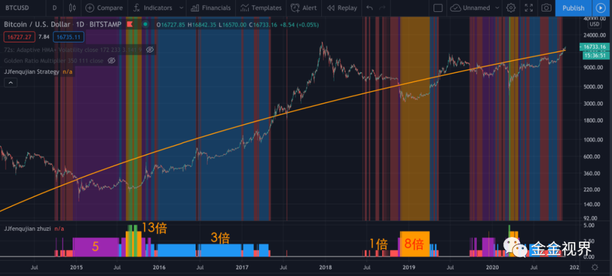

包含整个体系的策略来判断市场在哪个位置，是否定投，若定投，投入多少。

此指示器在Tradingview也有公开分享，大家也可以放在自己的图表上，不过只能用在Tradingview平台上。

总之，行情看趋势，趋势分周期，周期有顶底，顶底是范围。既然如此，定投，要考虑标的，即长期上涨的标的；也要考虑趋势和周期，即该买就买，该卖也卖；更要考虑范围，该多买的地方要多买，该少买的地方要少买。

这点对于资金使用的机会成本大的普通人来说，尤其重要。没有资金压力的人可以无视周期，看十年之后，但这点大多数人做不到。可以计算下自己无视周期每天等额定投的收益率，对比下就能明白。

而分区间定投，我认为不仅适合我，也适合多数普通人的一种投资策略。

### 8\. 现在是什么时候

当前2020年12月1日，大牛市的前期。

大概一个月前，定投指数0，停止定投。

明年真正的货币超发带来的影响才会显现。配合4年一个周期的币圈趋势，这个牛市会超乎所有人的想象。但也是最后一个这么疯狂的币圈牛市了。

大量机构、企业和顶级富豪的持续增持，更重要的是Paypal的介入，让触达人群的增速一下子达到极致，这个牛市过后，进入币圈的人数会持续增加，但增速很可能不会再增加了。

但要注意年底中西方的节日，以及现金流的紧张等问题，不要全部押上。

### 9\. 定投方式

一些平台定期定额买入，或者使用EXINONE，进行自动定投。

### 10\. 关于定抛

从比特币的历史走势来看，其特点是牛短熊长，适合定投。

而牛市高位往往是迅速而短暂的，一天之内就会有超过30%的震荡，平缓的定抛是不合适的，应该采取更大比例的少数几次分批卖出方式，结合一些重要的长中短期指标，也能比较好的把握顶点往下30%的区域。

关于定抛会在另一篇文章里探讨，高位抛售也是接下来一年半的主要任务。

最后，关于投资或者定投的内容，欢迎加微信jinvlog交流。

星球每日有相关定投信息和趋势行情分析，2021年1月1日之前8折，欢迎加入。

---

欢迎关注视频号

继续滑动看下一个

金金视界

向上滑动看下一个

金金视界