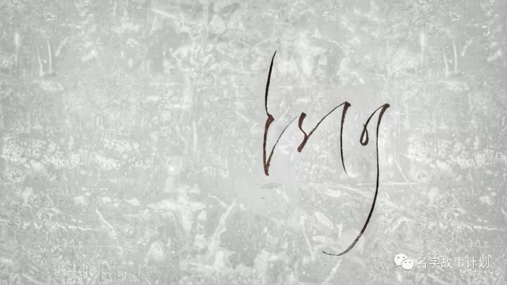

# 认知的逻辑
原创 金金视界 金金视界 *2018年12月15日 10:21*

名字设计之王立刚

---

### 认知是什么

认知，维基百科这么定义：

> 认知是“通过思想、经验和感官获得知识和理解的心理活动或过程”。

说白了，就是获得知识和理解知识的过程。

思想是你的观念，包括人生观、价值观和世界观等等。这里面每一项都有一个必需的要素：思考。

经验是经历过的体验。

感官获得就是看到、听到、触到、闻到。这些本质也属于体验。

即，认知的过程有两个要素：思考和体验。

思考很好理解，体验分两块：一是体验别人的经验和知识——学习，二是自己去做。

### 舒适区不需要认知

《士兵突击》中，许三多说：“人不能太舒服，太舒服就会出问题”。

“太舒服”是什么环境呢？

就是无忧无虑、不用劳动、感受不到饥饿和寒冷，想象一下，我们的一生中，有哪一刻是真正在这种环境下呢，是在母亲的肚子里的时候，那是一个极其安全的世界，不需要视觉、嗅觉、味觉，更不需要思考，这时就不需要认知了。

那这种不需要认知就能生存的环境带来负面影响就是：

> 因为没有匮乏、没有挑战，我们就不需要有任何认识问题、解决问题的能力。

外界没有压力让你需要认知，你自然没有动力去提高自己的认知，所以“舒适区”的代价就是缺乏认知能力。

### 认知是痛苦的

当你脱离子宫而出生，其实是脱离了一种绝对的安全感，你开始不得不面对睁开眼看到的一切， 陌生感会激发自己本能的恐惧感，你会哭闹，目的就是妈妈抱起自己，当回到妈妈的怀抱，你就会重新感受到那种安全感。

当你越来越大，就要面临这个世界的饥饿和寒冷，以及各种各样的凶险，你必须不断增加认知能力，去辨别、去了解、去解决那一个又一个生活、工作甚至感情中的问题。

然而，相当一部分人没有或者说缺乏这种认知能力，害怕痛苦，就去逃避困难，或者一味的选择“舒适”，这就是武志红所说的“巨婴”，年轻人里面的巨婴有个叫法，是“妈宝男”，一有事情，就去找妈。

其实，当你直面困难，解决问题的过程，就是提升认知的过程，这必然是痛苦的。

所以，有了这个前提，你就能以另一个视角来感受学习或者过程中遇到的困难以及思考的焦虑。这是认知增长的必然感受。

### 认知升级的方法

当你真正了解了一个概念，你就知道它的方法论了。

**认知就是通过体验和思考去增长自己的知识和理解。**

**所以，认知升级的方法就是去实践、去学习，且在过程中加以思考。**

李笑来对成长有一个定义，我觉得很实在：

> 成长就是想到之后做到。
>
> 如果想到之后不会，那就去学，学到之后再去做。

从想到，到学到、从学到、到做到，这之间存在着太远的距离，回想一下离现在最近的一次打卡活动，不管是写作、英语、健身还是投资知识的学习，你坚持了多久。统计一下当初的那个社群里，现在还在坚持的人有多少，你就知道这之间存在这一个鸿沟，每个鸿沟上都有一座桥。但是从“想到”到“学到”那座桥上非常挤，那是独木桥。从“学到”到“做到”那座桥上非常宽松，是水泥大桥，但却行人稀少，“做到”的就那么几个。

**马上去做，是提升认知的必经之路。**

> 纸上来得终觉浅，绝知此事要躬行。

从小，因为说的多，做的少，老爸很严厉的批评我，“不要做言语的巨人，行动的矮子”，我羞愧难当。从那之后，更多的时候，先去做，过程中自然体会到了不一样的东西。也让我知道，事情本身并不是想象的那样，哪怕做的不好，哪怕失败，都会让自己和只说不做的人有巨大的不同。

这甚至对“拖延症”都有效果，不管三七二十一，先去做，就跨越了心理上最难得那个门槛。

为什么认知升级的方法中必须有“且在过程中加以思考”呢？

**思考是让认知成为“我们自己的”认知的关键。**

一千个人眼中有一千个哈姆雷特，是因为每个个体的思考产生了想象，而每个人的思考必然是有差距的，所以产生的想象也是不同，这才是故事的精彩之处。

一个人去学习，去做事，去践行和体验，都必须有自己的思考，再用思考去改良行动，这个良性循环的过程中，会逐渐产生我们自己的价值观和方法论。

很多经典的故事和书籍，我们去学习，去阅读，每个人在同一本书中获取的关键点不一样，但没关系，只要把握住那些触动我们思考的、激发我们灵感的点，就够了，当这些不一样的思考和灵感积累的越来越多，就是我们绝对异于他人的认知。也就是不断升级，不断改进的认知。

我们成长的过程中，认知升级是必须的，但要知道，认知伴随着痛苦，所以不要畏惧。不论什么技能或者学科，去学习、去践行，行动中思考，思考改良行动，就会跨过那认知的独木桥。要知道，不断升级认知的人所在的区域，从不拥挤。
稀罕作者
