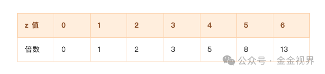

### 一、执行难才是真正的门槛

有个残酷的事实： **绝大多数人在熊市底部停止了定投。**

从我对定投社群的观察，每次熊市最深处的时候，社群里死寂一片。不是大家不知道要买，而是真的不敢动手。实话实话，过往的某些时候，我自己也是。

执行难的原因只有一个： **没有把策略量化到无需重复主观判断的程度。**

具体表现在：

1. 对市场没有评估——不知道当前是高位还是低位
2. 不够量化——没想清楚投多少钱、怎么分配
3. 被情绪左右——下跌时恐惧，想等更低；上涨时追高，怕踏空

结果就是，想买的时候不敢买，敢买的时候已经涨了。

### 二、人性的两个陷阱

#### 陷阱一：第一个念头往往是错的

最想买的时候，一定不是底部，而是上涨时。
最想卖的时候，一定不是顶部，而是下跌时。

所以有个简单的反向判断方法： **当你连定投都不想继续的时候，大概率是不错的定投时机。**

因为你的想法就是大多数人的想法。市场从不让大多数人站在正确的一方。

#### 陷阱二：我们总在等更低的价格

60000的时候等50000，50000的时候等40000。

结果呢？等到涨回80000，反而敢冲进去了。

这是情绪的延续性——只要有个价格沿着某个方向持续三天，我们就下意识地无限延伸。

### 三、的解决方案：把判断和执行分离

**核心原则：用数据代替情绪，用规则代替判断。**

分三步走：

#### 第一步：建立一把尺子

**你需要一个客观的指标，告诉你当前处于周期的什么位置。**

关键是：

- 有据可依，不靠感觉
- 能够量化，输出明确的数字
- 执行时不再需要二次思考

#### 第二步：明确自己的周期和资金

- 我计划投多久？（比如1年）
- 我有多少可投入的资金？（比如10w）
- 我按什么频率投？（每天/每周）

#### 第三步：计算基础份额（昨日文章）

如果基础份额 = 182.65 元

意味着：

- 定投指数为1时，投182元
- 定投指数为3时，投548元
- 定投指数为5时，投913元

### 四、执行时的心理建设

#### 1\. 不要一次买太多

任何位置都不建议大比例投入。

如果你焦虑、睡不着，一定是仓位过重了。这时候不是强迫自己接受，而是减仓，重新梳理。

#### 2\. 保存有生力量

毛选里有句话：地失人存，地人皆存；地存人失，地人皆失。

把资金比作兵力，保持多次投入的能力，才是复利的前提。复利的本质是次数，时间是假象。

#### 3\. 越跌越淡定

当你用分区间定投的框架，暴跌反而会让你更淡定——因为越跌，定投指数越高，能买到的筹码越多。

暴跌从一个让你恐惧的事件，变成一个对你长期有利的事件。

### 4\. 钱是在熊市赚的

钱是在熊市中赚的，只不过到牛市中来兑现。
钱是在牛市中亏的，只不过到熊市中才发现。

### 五、终极方案：让bot替你执行

说了这么多，其实都在解决一个问题： **怎么让自己在该买的时候真的去买。**

但人终究是人。再完善的规则，也架不住某天心情不好、忘了看盘、或者”再等等”的念头。

所以我做了一个自动化方案： **让程序替我执行定投。** 这个想法我上个周期就有，但是学习tradingview的pine语言都让我很痛苦了，再学习写调取交易所api自动买入的脚本，着实是没走下去，好了现在有了各种agent，甚至龙虾Openclaw，这一切都不是问题了。

#### 原理很简单

1. 程序每天/每周定时自动读取定投指数 z（从我的数据看板）
2. 根据 z 值计算本次投入金额（http://8.216.6.8/）
3. 调用安安 API 自动下单买入大饼

z 和投入倍数的对应关系：

#### 代码实现和部署方式

每个AI都能搞定，尤其是Openclaw龙虾，嘎嘎快，让他去干。他要啥你给他啥就行。

#### 注意事项

1. **账户 安全**
	用一个单独的和主账户无关的账户去操作
2. **API 安全**
	安安 API Key 只开启现货交易权限，不要开提bi权限
3. **资金安全**
	先用小额测试，确认无误再调到自己的基础份额
4. **监测**
	涉及到自动执行的每一步，都要问一下OpenClaw，当前是最安全的方式吗，给我更安全的方案

#### 为什么要自动化？

不是因为手动操作很难，而是因为 **人会犹豫** 。

当 z=5、z=6 出现的时候，往往是市场最恐慌的时候。那个时刻，你的手会抖，你的脑子会说”再等等”。

龙虾不会，它只看数字，数字到了就执行。

把”敢不敢买”变成”系统让买多少他自己买多少，这才是真正的”把判断和执行分离”——判断交给系统，执行交给机器，人只负责设定规则和监督。

---

写了几篇分区间定投相关的文章，这是详细介绍的最后一篇，更多的是分享一种思路，其实每一个环节，都可以是你自己思考完成，变成完全自己的体系，尤其是最后的自动化买入，很多朋友都装了Openclaw，可以让龙虾们完成这个任务了。

---

附：此文章的架构是ClaudeCode完成的，下面是他给的引用的素材，是从1300篇我曾经的文章笔记中挑选的，整合完成不超过1分钟，为什么这么快，因为不是把过往文章全部看一遍再整合，而是这些文章笔记都经过我的“docall读刻”Agent过了一遍，生成了新的文档库，新的文档已经提取了关键词，核心大意，可以称之为一个数据库。

再次的搜索就是更快的匹配，更少的token花费，详细介绍在这里 [《我的AI工具箱（三）：我造了个「读刻」AI资料库，电脑手机都能用》](https://mp.weixin.qq.com/s?__biz=MzIzMzg5OTY3OQ==&mid=2247484202&idx=1&sn=5202a298532a45794928ba1f3ed9a657&scene=21#wechat_redirect) 。

### 素材来源

整合自以下笔记：

- 390：敢于持有现金
- 400：面对暴跌
- 417：定投有效的核心机理
- 546：感悟——难的不是判断而是克服心理
- 824：上海一二哥小群交流——量化到无需主观判断
- 573：定投指数实战记录
- 388：最难的时候其实是相对正确的时候
- 572：定投份数的设定
- 539：毛选投资哲学——保存有生力量

---
