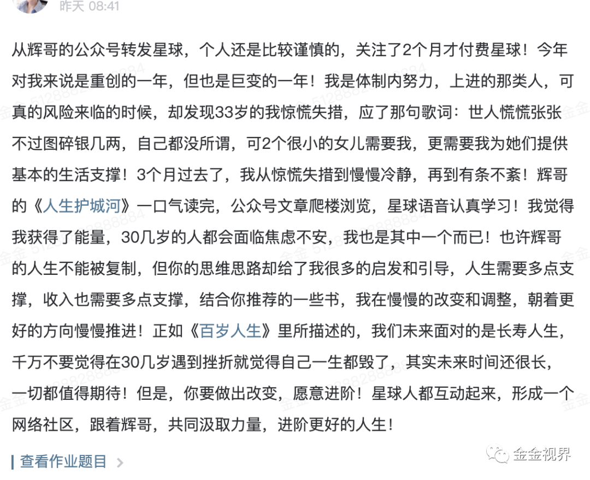

原创 金金视界 金金视界 *2020年6月27日 01:18*

有故事，会有意想不到的传播效果。

两个关于叙事方法的小事：

昨天，辉哥在他的星球里出了一道题目，问辉友们对星球的感受，星球的价值，自己的最大收获，以及对星球的建议。

我也写了回答，确实是自己的真实感受：

> 辉哥的星球内容，让普通人意识到要行动，且敢于行动。
>
> 具体我用的就是阅读和写作，针对性的阅读，加大阅读量，然后输出。
>
> 都说分享要有价值，但开始行动的人能输出的价值点不多，这个矛盾特别摧毁开始者的自信心。
>
> 辉哥关于写作的三点特别好，第一个就是真诚，辉哥有篇文章有个更接地气的说法：掏心窝子。如果你觉得没什么可说的，那就真诚的掏心窝子，说你正在做的事情，你的思考，都是可以的。
>
> 然后，才是价值，最后是专业。
>
> 这是一个普通人，在喧嚣之外可走的路。
>
> 这是特别好的建议和鼓励，不会走偏。
>
> 因为如果一开始盯着“为别人输出价值”，就偏了，就会刻意的生搬硬套，说了很多都是道理。
>
> 而自己从很差慢慢变好，那就最好的实践。
>
> 自己现在每日早上一个一个半小时固定的读书和读书笔记，理顺了的思考就发公众号，努力达到日更。

后来我看了下其他高赞的回答，大多数都有一个共同的特点：
这些回答大部分的篇幅是描述经历或故事，少部分是总结式的道理。

当我看到那些描述生动、情景具体、转折震撼的故事，也是印象深刻，甚至现在我回忆的话，记不起来他最后总结的道理，但对他营造的故事场景还记忆犹新。

比如下面这个：

第二个事情是最近研究视频号，做手绘视频，我认为内容说的还是比较有用的道理，但效果并不是太好，一些朋友的点评也着重强调的是视频制作形式（手绘视频）还不错，很用心。

昨天在浏览热门视频号时刷到了一个号，也是动画视频，从制作质量上看，非常用心，是在视频号火了，叫王蓝莓同学。

打开一看，每一个视频都讲了某个场景，独特的风格表现母女生活片段，涉及日常习惯、身份互换等内容，其中一个视频已经有3.1w的赞。

还有一个号是这样的，极易传播的寓言式的故事，故事引申出一个道理。画面一般，制作应该很快，但能调动一部分群体的情绪，一般在第二天、第三天左右的时间点赞量会上来。

这两个事都说明一点，更吸引人，更打动人的是故事，或者有明确场景的片段。故事应用于道理，场景应用于娱乐。

如果是个人呢？

也是要有故事才能传播，这才有所谓的传奇。

和平年代的故事，多是积累——能力质变——突破，或者积累——能力增加——抓住机会——突破。

积累永远是第一步的。

很多人的自我介绍也是这样，在什么事情上持续了多少天、多少年，如果再加上取得的成就，这就是他的故事。

做一个有故事的人，从一天一天的坚持做一件事情开始。

---

今天是坚持跑步的第22天，减重4kg，加油
