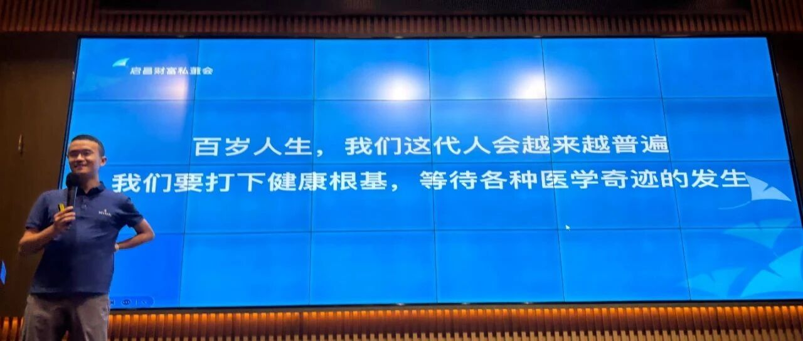
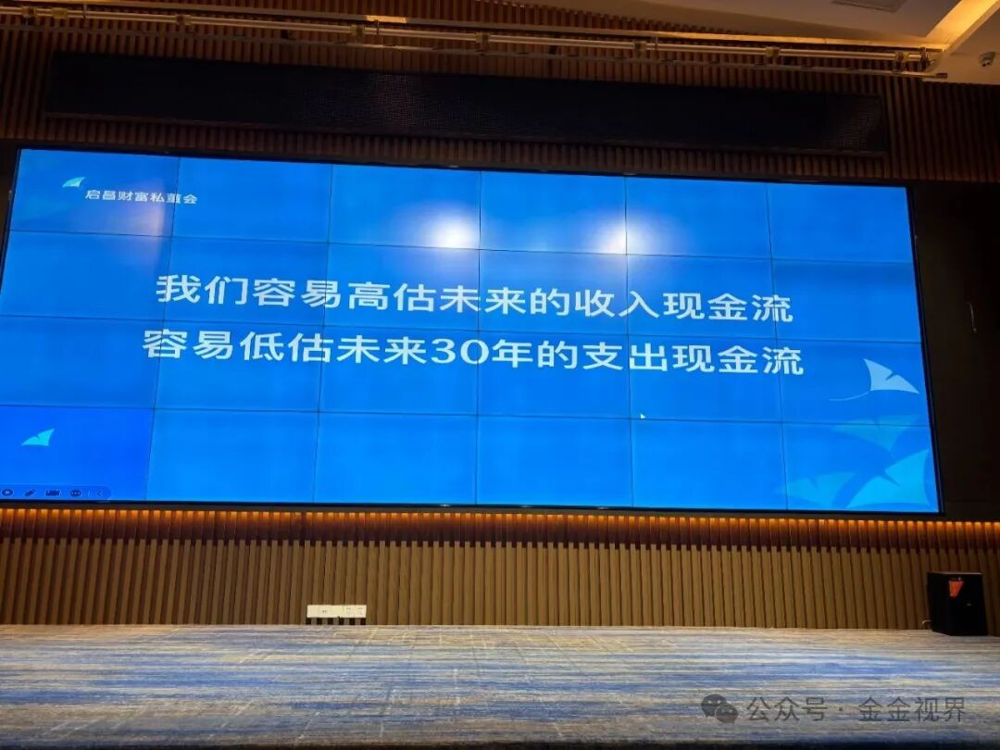
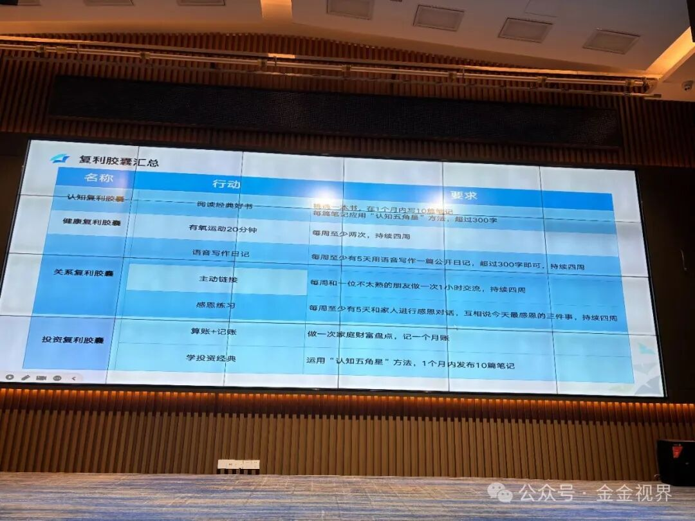

# 收获很大的复利人生课

金金 金金视界 *2025年8月16日 23:08*

14-15号两天，有机会参加了紫菜老板组织的几位老师的分享会，收获很多，复盘分享给大家。

第一天，启昌老师的主题是复利人生，分别从认知、健康、关系、投资四个维度进行了全面的分享。

启昌老师总结了复利的三个核心要素：大概率、小行动、不中断

> **大概率** ：长期方向正确，胜率很高
> **小行动** ：减少内外在的阻力，能够立刻行动
> **不中断** ：可以偶尔休息，不必紧绷，但长期要持续，不中断

基于这三个核心要素，在四个维度上，我们都应该去打造和执行养成习惯的最小行动单元

### 认知复利：

大概率正确的事情： **认真读经典，学关键领域的关键概念**

那么怎样通过阅读提高认知：

启昌老师给出了一个认知五角星的模型， **概念——应用——故事——相关——相反** 。

模型很好，我很受用，如果真的把核心的概念都用这个模型过一遍，不仅对概念本身会有非常深入的理解，自己脑海中的知识会越来越网状化，体系化。

同时，在选择这些核心概念时，老师给出了一个标准， **只选自己能做到的道理和准则，然后反复的练习，先在一个个单点上做到精深** 。

这部分，老师也解决了我在阅读上的一个焦虑，有时候会觉得自己的阅读不够，但其实经典的书，不用太多，重要的是对经典要吃透，深入进去。贪多嚼不烂，在认知提升上，也是一样的。

### 健康复利：

一个人的健康、时间和财富，三者比较好的状态能够重叠的时间不会太久，往往有10年就很不错了。
这是我第二次听到这个角度，第一次是在生才有术AI大航海中包子老师的分享，再次听到，依然很震撼。

在健康这个板块，老师建议，最少每周两次有氧运动，每次20分钟以上。

老师推荐了一个超慢跑，可以比走路快一点，让脚、腿和膝盖都处于一个相对舒服的状态去运动。

健康维度的复利，我感触非常深，因为反过来影响也很大。父亲身体不太好，世俗的事务影响之外，在个人行为上，长期的喝酒喝大量的抽烟，应该是导致身体不好的一个重要原因，当前的状态已经不能享受好的生活体验。毫无疑问，这种状态对整个家庭都是有影响的。

接受当前无法改变的果，但更要做一个种因的人，所以我的一个信念就是不能让自己的健康，对未来一定年龄之前的自己和家庭造成负面的影响。反过来，一个长期健康的体态，自己的获益也是无限大的。

今年新年以后，已经大概减了15kg，但并没有完全养成锻炼的习惯，在一个半月之前，开始每日锻炼一下内容：

200卷腹+50俯卧撑+100左右提膝——20-30min完成

当前目的是为了减肚子，结果是体重有不是很明显的下降，但肚子小了。体重接下来要在饮食上做更多调整。

我总结自己能够持续的原因：

**有人监督** ——公开，哪怕告诉一个人也行，对方最好也是持续锻炼的，找到小范围社群打卡也行

**行动阻力小** ——我早起在家里锻炼，年初有制定游泳的次数，但现在只完成10%，前奏太多是一个原因。

**环境** ——工作和生活中，尤其是触手可及的地方，不放零食甜品等垃圾食品，反而可以放哑铃之类的。

**让有益动作路径更短（随时可做），无益动作路径更长（取用麻烦）** 。

另外睡眠也是一个重要因素，秋庄说高质量的睡眠，对他的决策是有益处的，最近看他的操作一直在赚钱，点赞。他推荐了一个监测睡眠质量的戒指，准备挑个适合的颜色，戴一下，感谢秋庄。

### 关系复利

**弱关系创造好运，强关系创造幸福** ，很多意外的惊喜都来自于弱关系。

用心相交，让自己更加透明化，是最好的关系策略。这也是我需要提升的地方，更加打开自己。

在关系中的构建信任上，启昌老师给出了三个复利胶囊：

> **表达自己** ：语音写作公开日记，每周至少5天，超过300字，持续四周
> **主动连接** ：每周和一位不太熟的朋友，做一次1小时交流持续四周
> **用心感恩** ：每周至少5天和家人进行感恩对话，互相说今天最感恩的三件事，持续四周

启昌老师提到，每次交流都要给反馈，这是每个人都在意的，可以以复盘的形式。紫菜老板也分享了一个日常沟通中的方法，请教或者聊天的时候，可以从问题开始，红包结束，避免没有及时给反馈的错失。

在家庭关系方面，我在过去一个月，相对跟儿子待的多一些，发现更多的陪伴和沟通一定带来更亲密的关系，映射到和媳妇之间，也是如此，接下来要创造更多共同的经历和体验，更多的深度沟通。

### 投资复利

启昌老师说，投资复利是时间自由的终极武器。

Vendy有个特别好的说法，投资复利，是一鱼四吃，这个做好了，会有更多的时间去经营，健康、关系、和认知另外三个维度。

长期大概率正确的投资方法：

> **逆周期投资、低风险套利、资产配置**
> **不中断：风险管理、安全边际、居安思危**

逆周期投资：我理解就是不要fomo随大流，相对低地位买，相对高位卖，但如何实现就要自己去深入研究了，很开心启昌老师还提到我的分区间定投，没错，这也是非常易于执行的低位买入的方法。

低风险套利：比如打新等，肯定是一直可以做的事情

资产配置：核心就是相关性低的不同领域的且长期来看有增长价值的资产

投资复利的行动上，老师提供了两个方法：

> **算账+记账** ：做家庭财富盘点+记账一个月
> **学投资经典** ：运用“认知五角星”方法，一个月内发布10篇笔记

接下来一个月践行这个，运用“认知五角星”，发布4篇独立概念的笔记，也解决我这段时间的部分内容输出问题。

这次分享的第二天上午，是Tina老师做的关于社会化相关的分享，包括个人成长、情感、以及全球旅行等很多板块。

紫菜老板用超强的控场能力，跟Tina老师一起，结合多个伙伴的真实案例，进行分析指导，在感情和旅行问题上都挺多启发。比较深刻的一个核心就是要去多创造丰富的体验给自己，很多事情，把基数做上来，就更能知道什么最适合自己。

中午，秋庄请大家吃了顶配豪华猪脚饭，一点都不腻，真的很好吃，哈哈，感谢秋庄。

下午，嘉泽老师分析了盖洛普优势，我去年做过一次，但这次嘉泽老师的分析，让我对盖洛普优势有了全新的认识，建议没做过的伙伴，一定去做一下，更清楚的了解自己。

老师说，要通过盖洛普测试， **找出自己的优势，然后尽可能的发挥自己的这些优势，而不是去补自己的短板** 。不同的优势之间没有好坏之分，运用得好，都能够帮助自己成长和拿到结果。

现场的34张优势卡牌，选择哪些符合自己的时候，我发现，有时候会选自己希望成为的那样，而偏离自己真正是的那样，所以一定自己去做一次测试，应该是更准确的。

我自己的前五优势是，学习、审慎、交往、分析、体谅，描述还是比较准确的，比如学习，我对于新东西比较好奇，最好是和自己的事情结合起来。

在前一段工作流比较流行的时候，就想着，可否把信息收集，整理，处理，总结，推送，这几个环节完成闭环，就用N8N+DeepSeek+飞书+ChatGptO3结合起来，逐个环节解决，最终完成了这个闭环，一定程度上提高了效率，自己也是比较享受这个解决问题的过程。

接下来要去看下原来的报告，更深入的了解自己的这几个优势，和怎么把他们放大。
在这点，学习如何把自己的优势发挥最大，嘉泽老师也给出一个很好的方法：

> 1、研究规则：场景合适，发挥适当
> 可以做优势察觉日记，记录自己当天发生的事情和结果，复盘是那张优势牌发挥了作用
> 2、对过去自己的高光时刻复盘
> 3、对过去的至暗时刻复盘
> 4、他人的经验故事复盘

自己过去的很多复盘，更多是针对事情，而这种复盘方法，会从事情到人，更清晰的了解自己的思考和行为模式，然后可以针对性的练习或者规避。

### 感恩

最后感谢紫菜老板的组织，感谢薛总的机会卡，也感谢启昌老师，Tina老师和嘉泽老师贡献的高质量的分享。

作为团队负责人，紫菜老板也为自己的团队考虑的特别周全，不仅带大家赚钱，还带大家成长，包括情感、认知等各个方面都一起提高，恭喜紫菜团队的小伙伴，能够和这样的Leader一起冲，幸运且幸福。

感谢启昌老师超级系统且闭环的分享，能感受到，启昌老师在自己复利的四个维度上的深度打磨，不断优化，形成了一个完整的系统，更难得的是，自己在持续的践行这些原则。这个过程也是最自己的期待，向启昌老师学习。

感谢胡总的午休大床，很神奇，这两天的中午都进入了深度睡眠。

感谢秋庄的豪华猪脚饭，吃的很爽。

继续滑动看下一个

金金视界

向上滑动看下一个

金金视界