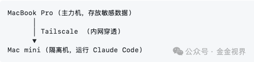

这是《我的AI工具箱》系列的第二篇。安全部署的部署Claude Code。

### 问题：Claude的权限很大

最近我一直在用Claude Code，它能直接读写文件、执行命令，堪称编程利器。

有朋友建议说不要装在本地，强大全面可能也有相应的风险。

我的MacBook上有工作文档以及其他比较私人的文件……让一个 AI 工具拥比较高的系统访问权限还是要注意，尤其是当我测试本地安装后，让Claude自己关闭访问其他文件夹的权限，只能访问当前项目文件夹，它做不到。

问题来了： **能不能让Claude Code在一个隔离的环境里工作，既发挥它的能力，又保护我的主力机？**

### 方案：物理隔离 + 远程访问

**我的需求是什么？用什么解决？**

| 核心需求 | 解决方案 | 为什么这样选 |
| --- | --- | --- |
| 安全：隔离Claude权限 | Macmini独立环境 | 闲置M4 性能够用 |
| 随处用：不受地域限制 | Tailscale 虚拟局域网 | 穿透力强，异地可用 |
| 稳定：可靠的远程连接 | SSH 终端操作 | macOS 支持，稳定 |

具体是这个路径：


### 实操：部署

#### 第一步：安装 Tailscale

两台电脑都装上Tailscale，登录同一个google账号，它们自动组成一个虚拟局域网。

安装完成后，每台设备会获得一个 `100.x.x.x` 的内网 IP。

#### 第二步：通过 VSCode 远程连接

这里推荐用 VS Code，因为它不只是连接终端，还能直接编辑远程文件、管理项目，体验和本地开发一样。

**配置步骤：**

1. 在 MacBook 上打开 VS Code，安装「Remote - SSH」扩展
2. 按 `Cmd + Shift + P` ，输入 `Remote-SSH: Connect to Host`
3. 输入 `用户名@100.x.x.x` （Mac mini 的 Tailscale IP）
- 用户名不确定？在 Mac mini 终端输入 `whoami` 即可查看
5. 首次连接会询问是否信任，选择继续，然后输入 Mac mini 的密码

连接成功后，VS Code 左下角会显示远程主机名，终端也自动切换到 Mac mini 环境。

#### 第三步：安装 Claude Code

在 Mac mini 上直接通过终端安装 Claude Code：

```
npm install -g @anthropic-ai/claude-code
```

完成。现在你可以在 MacBook 上，通过 SSH 远程使用 Claude Code，而它只能访问 Mac mini 上的文件。

### 进阶：提升稳定性

基础部署完成后，我让 Claude Code 帮我检查了 Mac mini 的配置，发现两个隐患，也直接给出了解决方案：

| 问题 | 风险 | 解决方案 |
| --- | --- | --- |
| 断电后不会自动重启 | 停电恢复后需要手动开机 | `sudo pmset -a autorestart 1` |
| 系统会自动休眠 | 休眠后 SSH 断开 | `sudo pmset -a sleep 0` |

执行这两条命令后，Mac mini 就变成了一台几乎「永远在线」的服务器。

| 配置项 | 状态 | 参数 |
| --- | --- | --- |
| 断电后自动重启 | ✅ | autorestart 1 |
| 系统永不休眠 | ✅ | sleep 0 |
| Tailscale 开机自启 | ✅ | \- |
| SSH 服务保持运行 | ✅ | \- |

### 方案对比：为什么不用其他方式？

在确定方案前，我对比了几种选择：

| 方案 | 安全性 | 稳定性 | 随处可用 | 成本 |
| --- | --- | --- | --- | --- |
| **Macmini+ Tailscale** | ★★★★★ | ★★★★☆ | ★★★★★ | 一次性 |
| 云服务器 | ★★★★☆ | ★★★★☆ | ★★★★★ | 持续月费 |
| 本机 Docker | ★★★☆☆ | ★★★★☆ | ★☆☆☆☆ | 免费 |
| 本机虚拟机 | ★★★★☆ | ★★★☆☆ | ★☆☆☆☆ | 免费 |

Docker 和虚拟机虽然免费，但隔离不够彻底，而且外出时需要主力机保持开机。云服务器什么都好，就是每月要交租金。

Mac mini方案的缺点是依赖家庭网络和电，但这出问题的频率太低了，可以忽略。

### 写在最后

这套方案我已经用了几天，体验很好。在异地，打开VScode就能连上家里的 Mac mini，让Claude Code帮我干活。

更重要的是，MBP上的文件，不用担心被任何 AI 工具「不小心」读到。

---

**这是《我的AI工具箱》系列的第2篇。**

我相信未来每个人都会有自己的 AI 助理团队。我正在探索如何安全、高效地使用这些工具，并把经验分享出来。

如果你在部署过程中遇到任何问题，欢迎留言或私信交流。

**下一篇预告：用 AI 搭建一套自动整理笔记的管理系统** ——让 AI 帮你把实时提交的笔记、文章、资料自动归类整理。感兴趣的话，点个关注不错过。
