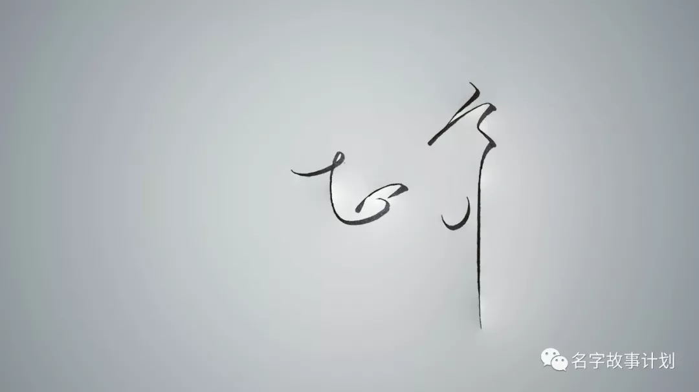

原创 金金视界 金金视界 *2018年11月30日 21:46*

正齐
图文无关，是闲暇时为别人设计的名字

---

> ***教是更好的学***

## 01 为了学会，才写了教程

最近自己琢磨Markdown写作调整样式时要用的样式文件css，写作用的是Ulysses软件，之前的文章有介绍（文末有链接）。软件当中自带一些固定样式，但是输出的效果不满意。下载到了李笑来老师在他公众号中文章所用的排版样式css文件，发现字太大，想调小一些，但是不认识css文件中的代码。

网上很少查到针对专注于写作而没有编程基础的人所写的css调整方法。本想凑合，就用现成的吧，但实在受不了不舒服的输出效果。

那就耐心去查吧，需要调整行间距了，就去在css文件中先找出哪些是控制行间距的，哪些是控制标题行间距，哪些是段落行间距，然后在复制这些代码去搜索，看怎么应用和调整。需要调整强调部分的颜色了，就去找控制强调部分的代码，然后去搜索这些代码，及其用法。

最后在css文件中修改，试着看输出效果。

因为这个过程很繁琐，所以我想，索性我把定义样式的css文档中的代码全部看一遍，不懂的就去查找，到达什么程度呢，到达我能够写一篇教程，指导别人可以更简单的调整自己想要的样式。

当梳理完内容，开始写教程时，我又发现，其实并不是非得全部理解样式文件css中的全部内容，才能调整出好看的输出效果。只要认识几个重点特征的控制代码，比如标题、有序列表、无序列表、强调、引用、加粗、斜体、分割线等，就可以在需要的时候找到它们，进行调整。

那根据入门的“最少且必要”原则，我就只列出这几个部分代码的详细解释就OK了。

当时没意识到，这其实就是为自己设立了一个考试。有了这个考试作为目标，当要把这件事讲的很明白，很通俗易懂时，那我的思考就要更深入，表达就要更直白。这个过程中大大加深了我自己对于设置css文件的熟练程度。

刚看了《如何学习》这本书，我发现上面这个过程也非常契合知识从学习到应用最快的过程。

那怎么样才是掌握了一个知识点呢？

## 02 知识应用的真相

真正的知识应用是能够在面临相关的问题时，把曾经的资讯记忆唤出来。 用记忆中的知识来解决面临的问题。
形象一点的说法，就是，考试。
从你的大脑中挖出某项记忆，看这个记忆是否能应对试卷上的那道考题。

但是我们肯定都有印象，小时候经常面对这样的场景：

> 打开卷子，看见了熟悉的题目，知道那是我们学过的，而且还是在书本上用黄色荧光笔划过重点线的东西，是我们昨天还能轻易背出来的名称、概念、共识。但我们没有办法完整的写出来，完成试题。
> 我们仍然考砸了，

为什么呢？

## 03 记忆的假象

真正的原因是：

> 我们误判了自己对学习内容的掌握程度。

心理学上有个叫做“熟练度”的概念。

我们当下对于内容的看到、甚至记住、熟练的背诵，会给我们一种错觉，尤其是那种让我们在读到时恍然大悟的内容，会让我们以为自己已经掌握了这个知识，或者认为自己下次再遇到这个境况，就不会犯同样的错误，就能够正确的解决问题了。

***我们忘记了我们会忘记。***

各种“帮助”学习的小手段，也会增加“熟练度错觉”。

在重要的知识点上划荧光线、做一份计划或者学习大纲。越来越多的知识服务商，提供的更加方便的音频课程，让我们更容易知道更多的知识，但更多也就止步于知道了。

这个过程让我们有一种心理上“接触”到知识的满足感，给我们一种“触到”即“得到”的假象。好多人不看书，却要买很多书，就是这个原因，这些书让他感觉知识上很“富足”。

这种满足感掩盖了我们的空虚，阻挡我们进一步学习。让我们对哪些东西还需要复习或者是练习做出误判。

## 04 跨越记忆的假象

任教于加州大学落砂机分校的比约克夫妇综合几位心理学和记忆理论科学家的研究成果，提出了“必要难度”原则：

> 你的大脑越是费尽力气地挖出某项记忆，你对其再次学得的程度也就越深，因为提取能力与储存能力都被增强了。而“熟练度”却恰好是这一原则的反作用：越容易唤出的资讯记忆，再次学得的程度也就越浅。

我定了《得到》平台的很多专栏，确实有刚才所说，听过的文章就感觉真正理解和记住了的错觉。也正是这种错觉，让我对已经听过的专栏文章，很难有耐心认真的再去看一遍。

这才是， ***听过了那么多道理，还是过不好这一生*** 的原因吧。

19世纪美国心理学家，威廉·詹姆斯在1980年给出了针对这种错觉的办法：

> 我们的记忆有一个特点，即主动的回想比被动的重复效果更好。
>
> 也就是说，以背诵为例，学到差不多时，最好先放一放，然后尽量去回想刚才的内容，这样学习效果比直接再看书更好。如果我们用心“回想”出了一部分词句，那几乎可以肯定下次还能再想出来。

在我们生活中有一个场景，使得这个过程是变成必须，那就考试。

不要被那些吐槽应试考试的言论所迷惑，单说考试本身，它不仅是一个测试工具，还能调整我们已经记住的内容，令大脑努力唤醒和重新组织那些内容，这个唤醒和调整的过程就会大大提高我们下一次考试的成绩。

## 05 习惯“考试”

> 考试其实就是一种学习方式，一种不同常规却很有功效的学习方式。

把考试的概念扩大，不要局限于学校的学习，它可以应用在任何知识的学习和技能的练习。毕竟，要想测量学习效果，就必须予以“考试”。

通常在学校考试后，我们会有一种感觉，如果再考一次，我一定考的更好。因为考试后，我们拿到分数，会知道哪些做错了、哪些不会做，会去找针对性的知识点进行解答，之后，就会印象深刻，所以会感觉再考一次成绩会更好。

> 大脑要从记忆中提取已经学过的课文、名称、公式、技能等任何东西，所要付出的努力远比直接重读一遍或者重学一遍要多得多，而这份额外的努力则加强了这些记忆的储存能力与提取能力。
>
> 这样做之所以能对数据信息或者技能的掌握更加牢固，正是因为我们并非简单滴重温了一遍，而是自己把它们从脑海中“提取”了出来。同时以不同于上次的储存路径将其重新存储了一遍。
>
> 这种变化使得支持该信息的脑细胞忘了也有了变化，这就是用我们的记忆改变我们的记忆。

有人会说，对于那些重要的考试，可能只有一次机会。没错，正因为这样，我们才得在那最终的决定性考试之前，自己给自己设定更多次的“预考试”，来检验，来训练自己。

只有这样带着之前的问题和错误，才能让我们注意到那些事需要加以注意的重要概念。

而对于通用知识和一项技能来说，我们的目的是越来越熟练的掌握，最终变成我们的特长。所以，相当多的情境下，都不是“一次性”的考试。没有那个“deadline”，也意味着我们没有那么大的压力去让自己去做“回想” 练习。

所以更需要让自己面临“考试”。

就像写作，很多人没有指标考核，没有界面简介好看、阅读量增加、别人的评价反馈的考核，没有利他的价值，自然不知道在哪儿发力，就会陷入重复性的写，即使写很多，也是没有质的变化。

> 考试能捣毁“熟练度”给人的假象，正是这东西使得我们以为自己已经会了。考试能增加学习时间的价值，带给我们事半功倍的效果。

考试让我们意识到问题，然后针对性的学习和改变，在这个捣毁“熟练度假象”的过程之前，我们经过了学习某一个范围里相对泛的知识，而这时，有些内容是不那么有用的，所以比捣毁“熟练度假象”更高效率的就是一开始就“针对性的去学”。

## 06 针对性的去学

前几天，《得到》平台的专栏老师陆蓉讲《行为金融学》的直播，有人问，陆老师，我想做一件什么事情，我想学一个什么知识，应该怎么看书？

陆蓉老师给出了最高效的回答：

> 你开始做吧，边做边学。比如，你现在想要投资，你会发现不知道怎么读公司的财务报表。
>
> 没关系，你找一本财务的书，把公司的财务报表是怎么看的给看明白，把这个问题解决掉，会看你手上的财务报表之后，财务的书扔到一边去。再顺着这个问题，你再往下看，你发现要分析一家公司，我想了解宏观经济的情况，要了解行业的情况，这个时候可能要用到经济学的知识。
>
> 这个时候，你把一本经济学的书拿过来。解决了这个问题后，经济学的书，请你也扔掉。顺着这个问题再下去，你可能就发现你要对这个公司进行估值，可能要用到数据分析技术，你再把一本数据分析的书帮你把这个问题攻克掉，你就可以把数据分析的书又扔掉。

我们不能期望把所有的知识都学完了以后再拿来用，其实你把所有的知识都学完了，你还是不会用。所以，我们要学以致用，以问题为导向的方法来学习。

学以致用，这其中的“用”，才对知识的最高级别的“考试”。

## 007 教是更好的学

> 只有你真当了老师、必须对别人清楚地讲述出来时，你才会真正吃透你要讲的东西。

把自己学过的东西表述出来，教给别人，这种方法并非简单的自我检测，这是一种更高效的学习方式。别人会给你最真实的反馈，这种反馈给我们的压力，会让我们更用心、更严谨的对待自己“触到”的知识，而不止是流于表面的“听一遍”或“读一遍”。

建议对任何新东西的学习都采取这种方法：

**阅读** ：不记录，无阅读；带着好奇的问题，然后写读书笔记，分享出去。

**写作** ：用“利他”来检测，利他本身就是一种“教”，别人在阅读时的视觉感受、知识获得、价值感受都是“教”的内容。每一项都应该用心去打磨。

**技能** ：任何小技能的获得，都最后用简介明了的方式分享出来。

***你能教给别人的东西，都是你比别人学的好的。***

---

[最好的输入软件——Markdown写作之Ulysses](https://mp.weixin.qq.com/s?__biz=MzIzMzg5OTY3OQ==&mid=2247483795&idx=1&sn=20aa62d7f6f99cc8dde5ad7d1e203fcd&scene=21#wechat_redirect)

[笑来老师公众号文章排版样式css关键内容详解](https://mp.weixin.qq.com/s?__biz=MzIzMzg5OTY3OQ==&mid=2247483801&idx=1&sn=752ce9dc49fbf17fec3810b68a0d2d24&scene=21#wechat_redirect)
