兰州——敦煌自驾，迟了几天的记录，简单分享

### 准备出发

在跟社服的对象——兰州绥远中学的交接完成之后，5号早上开始了预期5天的自驾，人数比预期要少，一些伙伴因为临时的事情耽搁了，最终出行的人是柳哥，柳哥爱人（后面称柳嫂），小云和我。

出行之前，早上7点45，军霞姐和姐夫带我们又吃了一次兰州牛肉面，这个叫法也是很严格的，在这里，最正宗的面，一定叫“兰州牛肉面”，而不是其他叫法。从粗细上来讲也是分毛细、二细和韭叶等。点了面，又加了一份新鲜煮好又放凉切成片的牛肉，把牛肉夹到放了辣椒油的碗里，香气四溢。

为了尝到牛肉面的筋道，整碗面在5分钟内吃完是最好的。本身河南人就喜欢吃面，我很快就吃完了，也因为前一天我因为下来完了，别人帮我点好的面开始坨了，浪费了一次吃面体验。

吃完面，去超市购买了一些路上的零食和红牛，准备出发。同时另外几位一起做社服的Buddy分别早上7点-11点的飞机，陆续告别，他们返程，温温广州，娜姐北京，薯条，佳佳，Ray返回深圳，Ella也绕道深圳返回厦门。

8点半，接到姐夫帮忙租的一辆GL8，4人同行，后面的人能躺，预计应该比较舒服，就选了这个。

### 机场截图

这时发生了奇妙的一幕

Ray返回深圳去往机场，但是带走了团队的愿景图，我跟柳哥说，要是带上愿景图打卡就完美了，柳哥说，问一下Ray走到哪里了，我看了一下导航，去往张掖大方向路过中川机场，我立即联系Ray，他们还有10分钟到机场，我们决定去机场截住愿景图，更新导航，发现正好500米后就是去往机场的出口，晚一分钟就错过，惊险。

到达机场出发口，Ray出来，我拿到愿景图，拥抱告别，各自出发。

### 多彩丹霞

柳哥直接开了6个小时，到达张掖，胡姐夫联系好的酒店，楼下吃了一顿炒肉片真的很不错，食材，口味都巨佳，饱餐一顿之后，出发，酒店距离丹霞地貌风景区30分钟的路程。

丹霞地质公园，建议下午4-5点左右到达，时间最好，记得做好防晒，带上墨镜，近视的朋友要提前准备，或者买一个镜套，护眼，再一个拍照很帅。公园主要四个观赏点， 2154，能拍到不同的丹霞景色。

没有看到所谓的七彩丹霞，红褐色，灰色，土黄色偏多，大面积的色带延伸和不同色带的交替，整体很是震撼

搭配干净、湛蓝的天空背景，随便拍都是桌面。
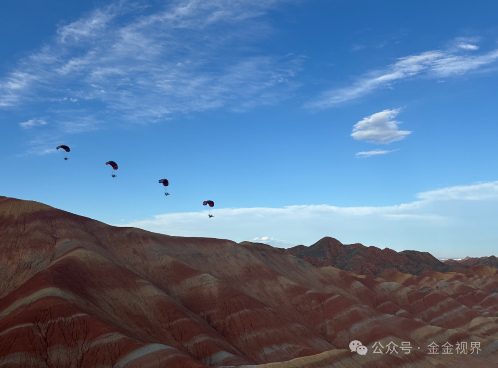
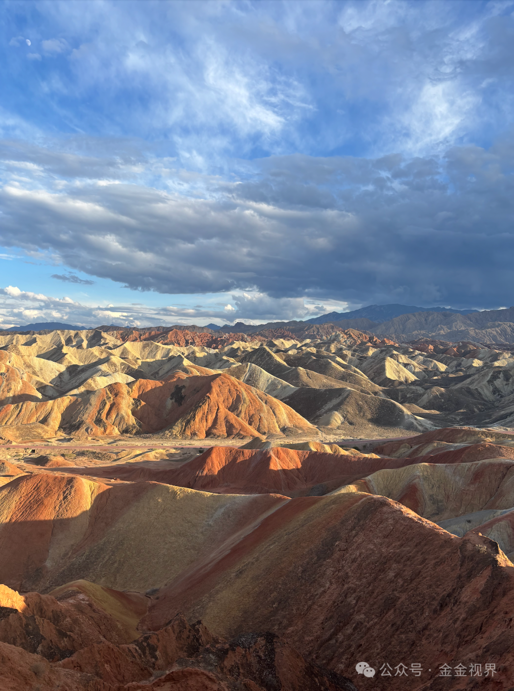
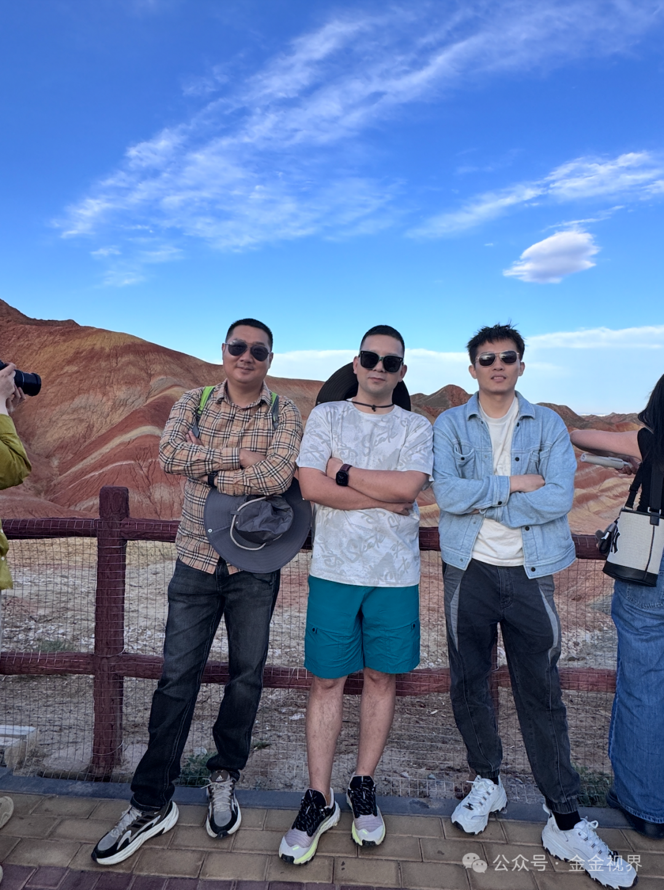

逛完丹霞地貌之后，返程，吃了烧烤，烧烤一般，应该是没找到好吃的地方

### 张掖—嘉峪关—敦煌

第二天7月6号，计划是，张掖的博物馆和大佛寺，嘉峪关，敦煌

张掖博物馆，详细的记录了张掖从先秦时期到清朝的历史和演变

张掖，位于甘肃兰州往西北500公里，是河西走廊四郡之一，四郡就是指武威，张掖，酒泉，敦煌，从东到西。张掖这个名称源于西汉时期，张骞两次出使西域，霍去病打败匈奴之后，取“张国臂掖，以通西域”之意。意思是张开国家（汉朝）的臂膀，连接西域。

张掖博物馆之后看了大佛寺，有现存最大的室内卧佛像，是西夏李乾顺时期修建的，除了现存最大的卧佛之外，也看到李乾顺本族即西夏党项人的介绍，印象很深，是因为西夏就是《天龙八部》中慕容复提到的西夏，他企图联姻西夏公主、借西夏军力复兴大燕。

看完大佛寺之后，直奔嘉峪关，行程大概230公里，大概下午2点到达之后，先搜了一个小红书推荐餐厅，点了两斤手抓羊肉，大份大盘鸡，量大且味道确实没得说，手抓肉，软嫩没有膻味，大盘鸡的土豆是一绝，狂炫一顿，四个人没吃完。
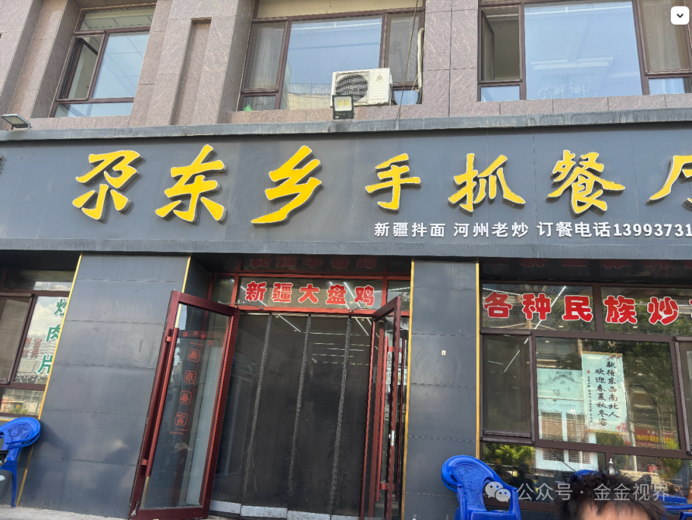

之后就去打卡天下第一雄关——嘉峪关。

嘉峪关的关城其实是明朝初年才建里的，是明长城的西端起点。但这个位置是汉唐已经被商旅踩出了成熟的路，自然踩出的路，几乎一定是成本最低，风险最小的路线，所以这也是河西走廊的必经之路。

相比山海关，嘉峪关的城墙尺寸不大，但戈壁孤城的视觉冲击力更强，登上去，环顾戈壁沙漠，感受它的雄壮。

还第一次把BL60的愿景图拉出来拍上，效果很不错，很多路人都不断拍照。
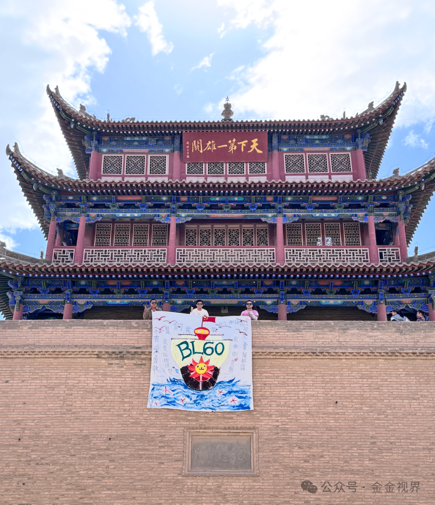

愿景图上的两段文字是

**我们是一个有爱勇敢负责任的团队**
**我们承诺创造一个喜悦和谐自由的世界**

信条会影响行为，当在心中闪现足够多的时候

从嘉峪关城墙出来，看到两个浮雕，一个是唐僧师徒四人，一个是张骞出使西域

两个团队都是经历千辛万苦且脚踏实地拿到了超大结果。

嘉峪关结束，大概5点，没有停留，直奔敦煌，九点半到达敦煌，直接导航到提前安排的酒店，稍微有点偏，就退了，定了个夜市较近的位置。

当天到达敦煌很开心，因为有之前的一位卓越组长思思也提前到达了敦煌，并且第二天就要走，如果我们晚一天到达，就碰不到，最终大家一起吃了宵夜，酒都喝了不少，小云也晕了，除了柳哥没事，他酒量太好了。

隔空为了共同的目标而努力，最终达成，体验很好。大漠、落日、敦煌、飞天，和朋友一起在遥远的地方，吃肉喝酒聊天，让自己彻底放松，很能解压。

敦煌的夜市那条街，极其热闹，从表演，到小吃，到各种石头首饰，还有很多的手工艺人，看不过来的精美工艺品，可以认真的逛好久。

另外敦煌的杏干尤其好吃，韧糯香甜，属于李广杏，而李广杏的由来，是一个因杏而救了李广大军的传说。

后面抽几位留言的朋友，每位送2斤李广杏干。
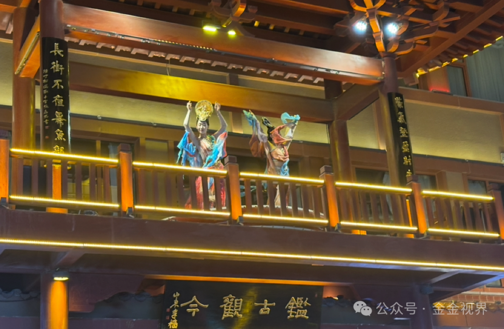
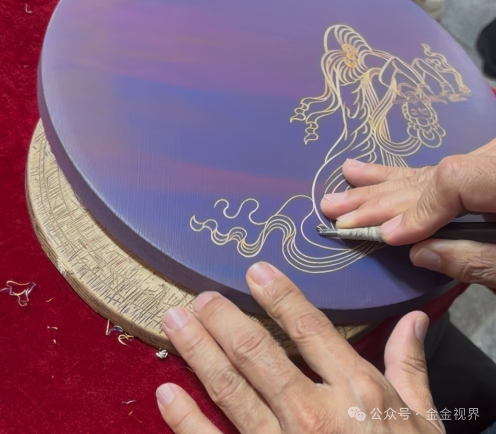

### 春风不度的玉门关

敦煌的第二天是深度游

原计划是先看看《又见敦煌》，晚上看鸣沙山万人演唱会。《又见敦煌》是下午2点开始，所以早起的时间又跟柳哥和思思赶去了一趟距离敦煌一个半小时车程的玉门关。
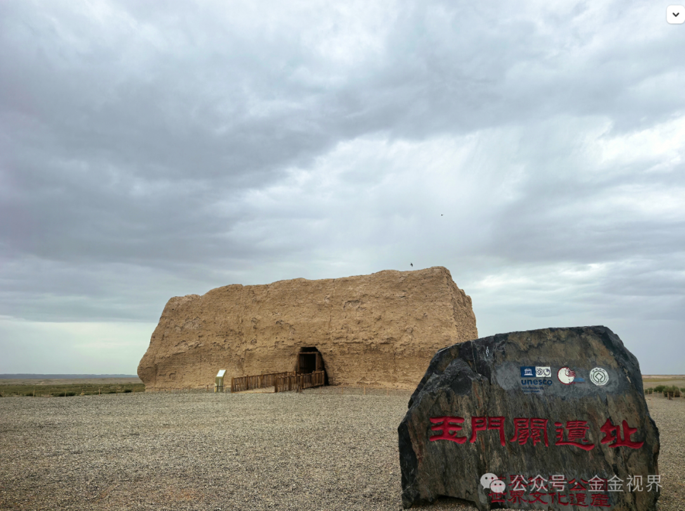



虽然千年的风化已经使其只剩一座土城墙，但还是一定要来这里看看，算是对武侠情怀的一种执念吧，很多电影里有提到玉门关，很喜欢的《新龙门客栈里》最后一段：

周淮安对金镶玉说：“我不像你有勇气面对这个沙漠，我出关了”。
金镶玉策马回到龙门客栈，对刁不遇说——“拿酒来！”，随后酒坛掷向屋脊背，扔了个火把，火光淹没龙门客栈，也映红了她自己。
她面容坚定，略带微笑“我们离开这个无情无义的地方，走！去找周淮安！”
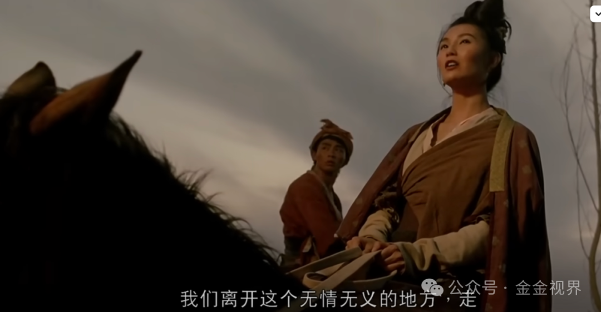

总希望这样的电影有续集，看到他们后来的故事，但这种缺憾或许也让每个人有更大的不同想象。

为什么玉门关这么重要呢？它象征着一个边界，也是很多人心理的边界。

王之涣的《凉州词》：羌笛何须怨杨柳，春风不度玉门关，是说春风吹不到玉门关，委婉表达了对皇帝不顾及戍守玉门关边塞士兵的生死的抱怨。而《新龙门客栈》里他们护送两个孩子出关却是因为出了玉门关，就不被官兵追杀了。

“出关”意味着自由，也意味着不再被庇护，王维的诗中“劝君更进一杯酒，西出阳关无故人”，是说，兄弟，再干一杯！出了这道关口，你就要独自面对漫长沙海，没有一个人会像我这样了解你、支持你、替你挡风遮沙了。“阳关”离玉门关很近。

### 敦煌——《又见敦煌》

玉门关回来送思思和她女儿去机场，之后我跟小云，柳哥，柳哥媳妇一起去看《又见敦煌》，都说看莫高窟之前一定要看一次这个剧，看过之后，确实如此。

《又见敦煌》
导演王潮歌，又见系列的核心导演，90 分钟沉浸式行进体验剧，舞台、人物，都很精彩，就是剧情，个人感觉有些单薄，很多经典的典故和人物没有提到。但很值得一看，更全面的了解敦煌以及莫高窟的历史和演变。

剧中有几幕专门提到持续在敦煌做保护和研究工作的几代人，孜孜不倦，他们研究莫高窟的历史，自己也是莫高窟的历史。

更多精彩的现场，如果大家去的话，定要自己观赏一下。

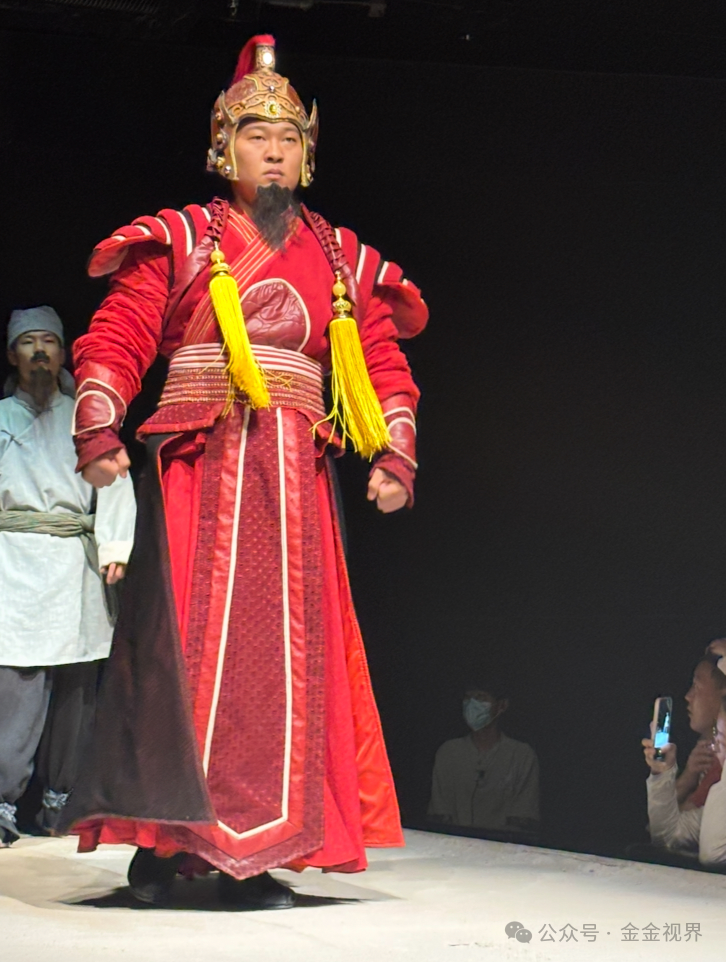
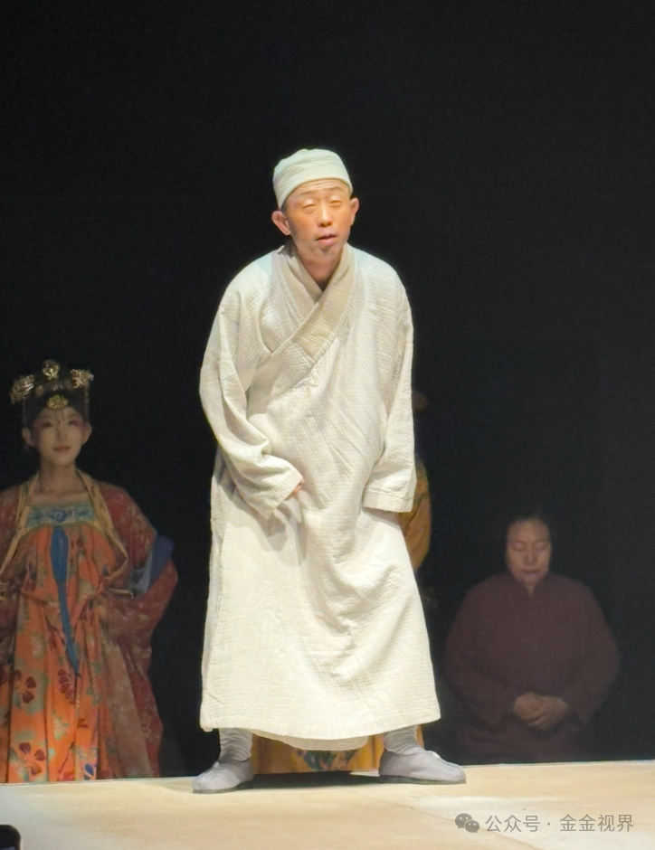
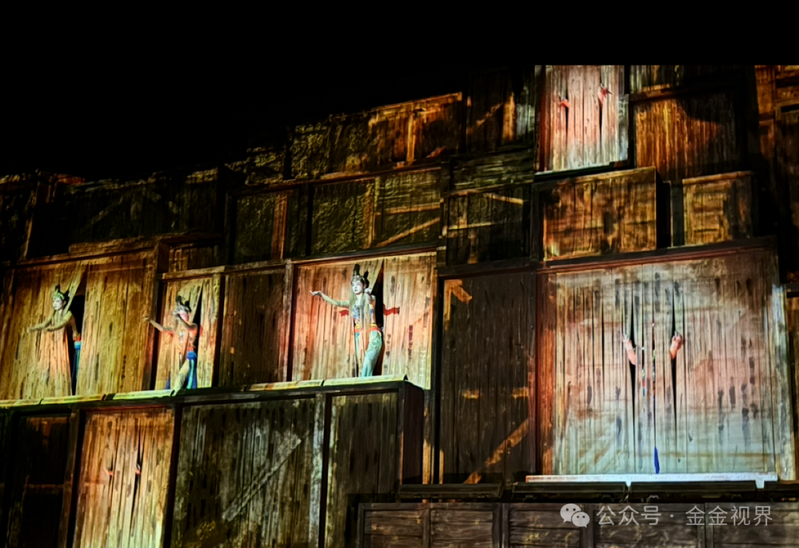
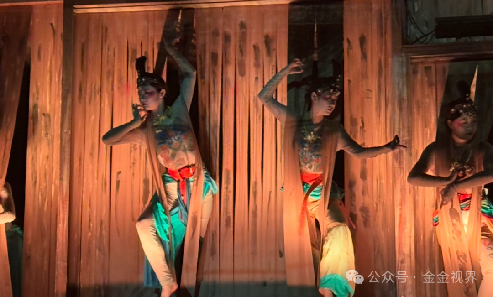


晚上，本来要去参加鸣沙山万人演唱会，赶上暴雨，柳嫂用了很长时间做妆造，最后的拍摄也因天气受到了影响。最后我们选择不去演唱会，而是去了一个很有名的餐厅，尕六手抓餐厅，通常要排队一个小时，过去之后，看到老板和很多明星的合影，确实是网红餐厅。

好在味道食材质量都很好，手抓肉，麻辣羊肚，羊杂汤，沙葱炒鸡蛋，都很值得品尝。

7.8日一早去了敦煌博物馆，然后吃了碗牛肉面，出发大柴旦，途中绕道了一下阳关，“劝君更进一杯酒，西出阳关无故人”，就是这里。

从阳关到大柴旦，在G3011上，我开了最好开的将近200公里的路程，一路上同向车辆不超过10辆，夕阳西下，远山雪顶，很舒服。

### 大柴旦

8号晚上到达大柴旦最繁华的一条小吃夜市街，是的，又是先找去好吃的地方，小红书搜一下，再在旁边一些摊铺上问一下，综合下来，一般不会踩坑的。经典的炕锅羊肉，烤串，手抓饭，口味都很在线。

由于海拔较高，饭后大家没有聊天，各自回去准备休息，看时间还早，一个人逛了一圈大柴旦的夜市小摊，给媳妇买了一条围巾，自己挑了个红石头手串，很便宜，主要最近对红绿有执念，看着是很舒服，后来在广州的荔湾广场转了一圈，发现批发地才是石头最全最便宜的地方，但很多价格也几乎跌了一半。

### 翡翠湖

第二天一早，照旧找了当地的地道的牛肉面，之后开了十几公里，就到达大柴旦翡翠湖，翡翠湖的景色是这一路过来最漂亮的，翡翠湖不是一整个湖面，而是一大片盐滩，分很多个湖面，每个湖面的颜色有不同，翡翠蓝，孔雀绿，还有湖面呈现淡黄色，颜色的差异来自于每个小湖中盐的浓度不同。

这里拍摄了跟七彩丹霞差不多多的照片，景太好，没拍摄技术也能效果不错，唯一的就是要注意防晒，紫外线指数一直很高。
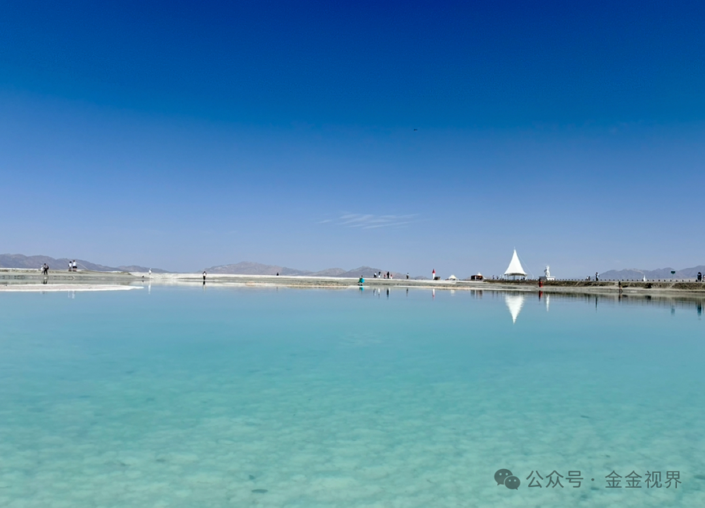
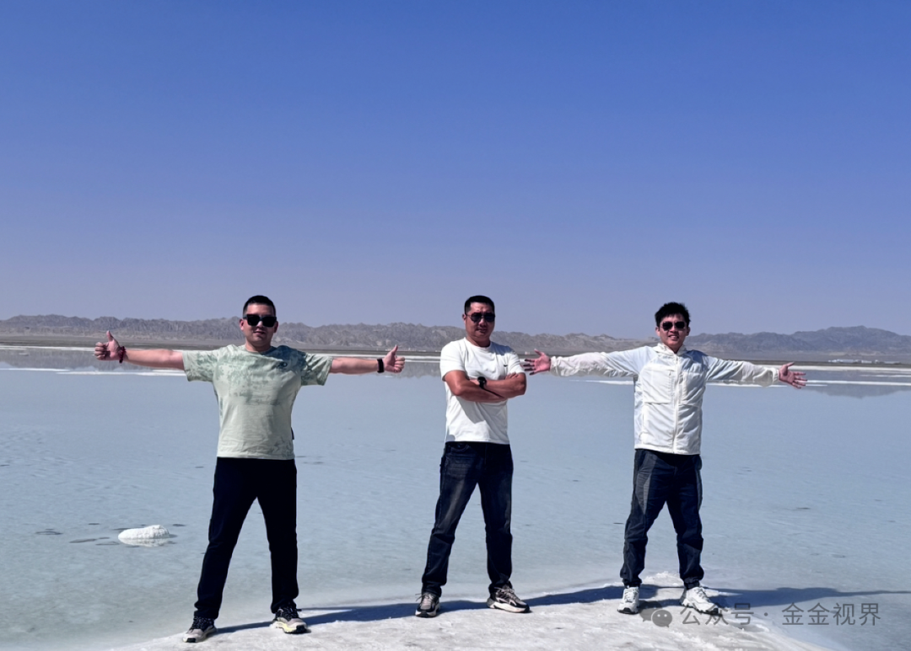
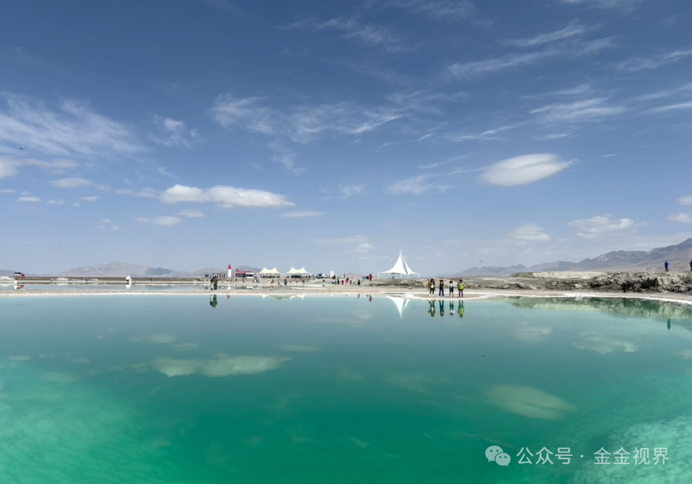


翡翠湖景区进区可以做小火车，但如果没有高反，建议走过去也挺好，距离入口3公里，能够完整看到几乎所有的一个个湖面。

翡翠湖出来，就沿着青海湖的南边沿湖公路开到西宁，中途二郎剑景区打了个卡，还看到了的德令哈三个字。

### 路过德令哈

突然看到德令哈的路牌，觉得熟悉，好半天才想起来，前一段欧阳夏丹一段很火的视频，朗诵的就是海子的那首诗《今夜，我在德令哈》，读起来听起来都很感动。
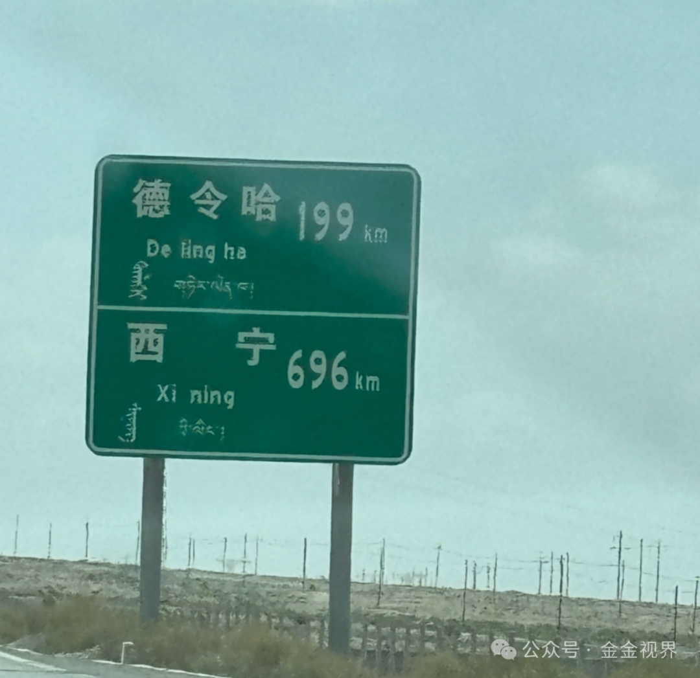

刀郎也因为超级喜欢这首诗在海子离开后，专门跑到德令哈，但后来刀郎说，真正的德令哈已经被海子带走了。

### 返程

到西宁已经夜里，找了家吃的，逛了夜市，总体这里体验一般，就没做停留，连夜开回了兰州，今天一共开了900多公里，确实有些赶了。
10号早上到达兰州，送柳嫂去机场，把小云放到机场附近酒店，跟柳哥返回市里，休息了一下。

晚上约了军霞姐和胡姐夫吃饭，他们定了一家很有特色的黄河岸边的楼顶餐厅——涛哥的楼顶，兰州的昼夜温差大，太阳一落山，温度就下降到20度左右，黄河风一吹非常的舒服。

直面黄河，真的是名符其实，波涛滚滚，虽没有一丝清澈，却同样震撼。

抬头望去，天空却全是湛蓝，对比帐篷的红艳，绝了。
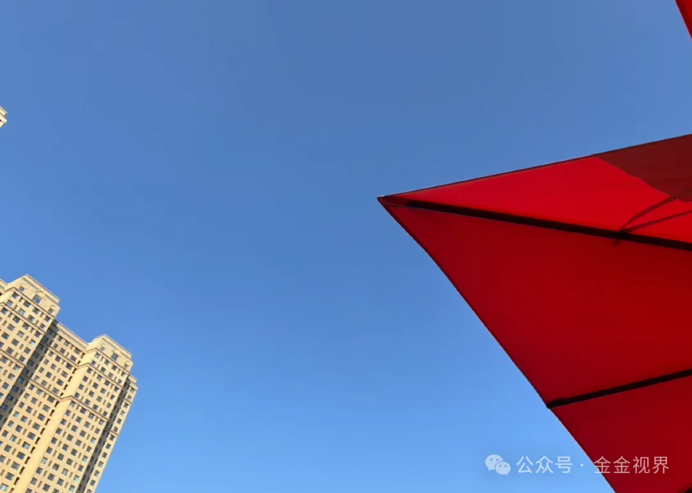


很遗憾，因为赶飞机，这顿饭吃的有些匆忙，没能够跟军霞姐和胡姐夫多聊聊天，感谢军霞姐的包容、支持和对大家的在乎，胡姐夫很博学，非常周到和全面，见识和认知也非常高，很多人生经验都很有启发，后面一定再创造机会去兰州，聊尽兴。

似乎可以定兰州为自驾新疆的出发地，也很不错，哈哈。

人生是体验的总和，期待未来更多的体验
