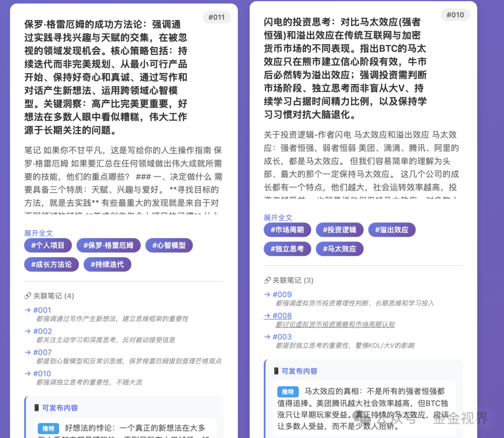

# 我的AI工具箱 #03：我造了个「读刻」AI资料库，电脑手机都能用

这篇文章主要聊下构建自己的资料以及笔记管理系统：

过往很多资料收藏或者内容写了之后就忘了，甚至收藏或者写的时候，是唯一一次接触这些内容的时刻。

但重读过往的内容，依然被触动，依然觉得很有价值。事实上，很多认知最核心的东西，都是一样且在重复的。

过往我也用印象笔记、Ulysses这样的写作软件进行归类整理，但每次新建页面、想标题、打标签、归类……这个过程很耗费心力，而且整理完之后也很难想到再取出来用。

## 我的解法

我给自己造了一个「一键入库」的系统：

**电脑上：** 选中内容（文本/文档/URL） → 快捷指令 → 提交整理
**手机上：** 选中内容（文本/文档/URL） → 发给TG机器人 → 提交整理

提交整理部分发生了什么？

1. AI 读懂你复制的内容
2. 自动生成 100 字摘要
3. 自动打 3-5 个标签
4. 自动找到和之前笔记的关联
5. 帮忙写好「可以发的版本」

## 和「手动整理」的对比

**以前（手动）：**

```
看到好内容 → 截图/收藏 → 想起来要整理 → 打开笔记软件 → 新建页面 → 粘贴内容 → 写摘要 → 想标签 → 归类 → 放弃
```

**现在（自动）：**

```
看到好内容 → 复制，快捷指令/发给Bot → 完事
```

步骤从 10 步变成 2 步。心理门槛从「算了下次吧」变成「随手一下」。

## 这是一个怎样的系统

**核心理念：Zettelkasten（卡片盒笔记法）**

Zettelkasten 是德语”卡片盒”的意思，由德国社会学家卢曼发扬光大。他用这套方法一辈子产出了 70 多部著作、400 多篇论文。

**三个核心特征：**
\- **原子化** ：每张卡片只记一个观点，方便像”乐高积木”一样自由组合
\- **双向链接** ：笔记的价值不在于”存了什么”，而在于和其它笔记产生了怎样的”关联”
\- **非等级化** ：不用文件夹自上而下分类，而是通过链接自下而上形成网络

传统笔记是 **树状结构** ：文件夹 → 子文件夹 → 笔记，找东西要顺着树枝爬。
卡片盒是 **网状结构** ：笔记之间相互连接，像大脑神经元一样。

**终极目标：辅助写作与思考。**

我让 AI 自动帮我做这件事——每次添加新笔记，它会扫描所有旧笔记，找出相关的，自动建立链接。时间久了，笔记会形成一张知识网络。

当你需要写东西时，不是从零开始，而是把相关的”知识积木”提取出来，顺着链接线索，内容自然成型。

**技术上：**

它是一个本地数据库（SQLite），不是云端服务，不是笔记软件。

结构很简单，三张表：

**笔记表** ：存原文、摘要、来源、时间、文本ID

**标签表** ：关键词和文本ID，每条笔记可以有多个关键词标签

**关联表** ：文本ID，以及笔记之间的链接关系

为了直观感受，给数据库做了个HTML的前端显示，如图：



## 如何搭建

**需要：**

- 一台一直开着的电脑（旧电脑、Mac mini、云服务器都行）
- 一个 AI API（我用Claude的API）

**核心就三件事：**

1. 写个脚本，让 AI 帮你处理内容，AI就可以调用自己付费的大模型API
2. 电脑上设个快捷指令提交内容，选择文本、url、文档等内容形式，右键快捷指令提交
3. 手机上用Telegram Bot触发它，选中内容，复制到Telegram Bot对话框中直接提交

需要更具体流程或者脚本的，可以留言或者私聊。

## 建了这个库，怎么用？

### 1\. 写作时：素材库

写文章卡壳了，搜一下关键词，3 秒找到所有相关笔记，还有它们的关联笔记。

### 2\. 发现意外关联

这是卡片盒笔记法最神奇的地方。

我记了一条关于「止损」的笔记，系统自动关联到「沉没成本」和「情绪管理」。

发现： **止损难，不只是技术问题，是心理问题。**

这种「发现」在传统文件夹式笔记里挺难出现的。

### 3\. AI 问答

结合最近很火的 Clawdbot，可以这样用：

```
语音输入：我之前记过关于复利的内容有哪些？整理成一篇逻辑完整的总结（可选）
```
```
AI：你有 23 条相关笔记，主要涉及：写作复利、健康复利、兰启昌老师复利专场分享...
```

让 AI 基于 **你自己的知识库** 回答问题。

## 编外

为啥叫“读刻”呢，因为最开始给这个项目文件夹命名是Docall，取Document all之意，AI告诉我拆成Do call也不错，谐音一下也不错，读刻，“读取并刻录”，哈哈，读刻AI资料库。

## 总结

「读刻」是一个让 AI 帮你自动整理笔记、建立关联的本地知识库系统——你只管记录，它帮你织成网。

**把「整理资料和笔记等内容」的摩擦力降到最低。**

摩擦力越低，我越愿意也越容易记录更多。

这是一个正向循环，也是一个 **复利系统** ——随着时间拉长，随着积累持续，作用越来越大。

---

*能用起来的系统，才是好系统。*
每种方法都各有优劣，适合自己的才是最好的，一起学习，欢迎交流哇

---

**往期回顾：**

继续滑动看下一个

金金视界

向上滑动看下一个