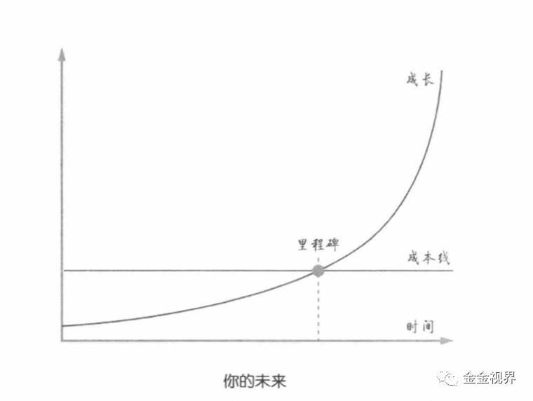

*2020年06月17日 《财富自由之路》前言&第一章—金金笔记*

### 前言

#### 1、“知识传递”本身不是教育

> 知识真正起作用，靠的是知识的吸收者，即学习的人，而不是传递者。
>
> 就像学习健身知识一样，如果不进行大量运动，不去跑步，不去推杠铃、做深蹲，不去做各种各样令人难以忍受的动作，那吃什么都没用。
>
> 懂了那么多道理却依然过不好这一生，就是因为他们“不运动”，不去运用那些道理，所以就没有机会在运用中调整自己及自己对那些道理的理解和感悟，即没有完成知识的“内化”。

思考：道理简洁，阐述的很清楚了，这其实恰恰是普通人最好的一条逆袭之路：为什么大部分人不去运动，不去运用那些道理呢，因为这些都必须付出大量的体力和精力，这是逆人性的事情。有难度的，跨过去，就是竞争力。

有句话这么说：能够戒掉烟的和减掉肥的男人都是可怕的，说的就是那可怕的意志力，抵抗欲望，专注于必要的事情。

当然这里不单单是意志力，还有技巧性的东西，比如达成行动的路径，该做的事情路径要尽量短，不该做的事情，路径要尽量长，阻碍要尽量多，这个随后结合自己的健身过程慢慢展开分享。

#### 2、半途而废是大敌

> 很多人“挣扎”过，但却和从未“挣扎”过的人下场一样，是因为“挣扎”的不够。任何道理都和我们平日里使用的任何“工具”一样，要在大量使用之后才能进入“熟练”阶段，而后才能运用自如。

思考：靡不有初,鲜克有终; 善始者实繁,克终者盖寡。行动中断，是大多数人的困境，你我皆凡人，一定要有人一起，形成团体，共同监督和鼓励，一起持续练习达到“熟练”阶段，或者最起码达到不会再抗拒练习的状态，会让达成目标的概率大大增加。

#### 3、践行有章法

> 笃信“进步”是有方法论的，所有的事情，都有方法做的更好

思考：基本的方法论可以来自于前人的经验，更好的方法论，一定来自于自己实践后的总结。真正的理解，来自于大量，超大量的输入和输出。

### 第一章 你知道自己未来是什么样子吗？

#### 1、成长，只有突破成本线才有意义

思考：成长本身是个动态过程，在这个概念上，成本线的本质应该是一个效率值，即，在某一方面，当你的效率超过某个值之后，成长的速度比时间流逝的速度要快。

#### 2、自信不自大

> 要对自己的美好未来盲目相信，甚至要120%地相信，哪怕被别人泼冷水，大基调20%，依然要100%地相信。

思考：起步的过程是最难的，这个时候最大的威胁就是别人的打击，克服了这个，保持自信，然后能够持续下去，是获得阶段成果的关键。是自信不是自大，自信是为了自己的践行动力，自大是无知。

3、敢于花有用的钱

> 在达到成长的成本线之间，鼓励花钱，因为那时赚的都是小钱

思考：这里应该是指敢于花费到努力学习，认识牛人上，尽快提高学习速度。

### 行动点

1、对于持续写作，沿着三个阶段持续进行

**1） 真诚** 有人会说只写自己做到的东西，其实不现实，难道没做到的事情就不能写吗，其实不是的，只要我们保持真诚，只写我们自己相信的东西。你认为有价值的东西，就有可能，别人看到也觉得有价值。

**2） 价值** 这是我们应该追求的目标，在经过长期的输入输出之后，会发现哪些东西大概率对别人是有价值的，那很可能别人就觉得真的有用。

**3） 专业** 在价值的基础上，深挖，延伸，结合自己的实践和思考，形成独特的有深度的东西，分享给大家。这也是写作者的价值所在。

2、增加阅读的量

书本和深度文章，文章聚焦在辉哥奇谭和Scalers的公众号上，每个号每日读两篇文章，并形成笔记。
