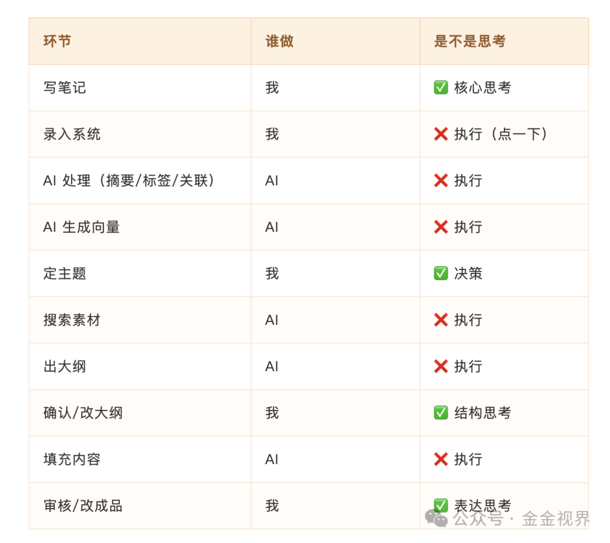

推上看到博主宝玉的一篇帖子，说真正决定内容质量的是素材、模型和审稿能力，就像做一道菜过程中的食材、厨艺和口味。很有启发，结合最近做的一些事情，聊一聊。

### 食材——素材

如果只给主题，让 AI 自由发挥，只会拿回来一篇正确但空洞的文章。

宝玉认为至少给主线和关键点，素材很关键，价值在于做过筛选和判断，最省心的是翻译和视频访谈稿。

我觉得更珍贵的素材是 **自己过往的文章和笔记** ，那是逐字逐句敲出来的，包含了最真实的经历和体验。

所以大量真实的记录，是最珍贵的素材，是金矿，好的内容可以从这里出来。

然后是经典的内容、精彩的访谈稿等。

素材相关的这部分我过往的痛点有两个：

一是自己的内容和看到的别人的好内容，在存下来的过程中，需要分类、更改格式等各种处理，路径有点长。像微信收藏倒是简单，但收藏了，基本全忘。

二是未来在输出类似话题的时候，想到过去的相关内容在哪里，以及搜出来过一遍，挺耗费精力。

用过印象笔记、幕布、石墨笔记、Ulysses、iA Writer，也有过很用心地把内容分类、分条目、分文件夹保存。但实际的体验是，要找具体的内容文档，我还是要搜。这个整理出来的结构化呈现，貌似没用上，而且这个过程涉及到深入思考的部分少，多是执行。

那 AI 是怎么“获得”和“看”内容的呢？

其实 **AI“看”的过程的本质是搜索，所以我认为结构化的视觉呈现，对它没有意义** 。

很多 Agent 或者 Skills 的优化，聚焦在如何搜得准、如何搜得快、如何搜得省 token。

基于此，我暂时（边使用边改）放弃了这种结构化整理文档的方式。文档进库，经过两个维度的处理：

一是 Claude → SQLite，包含笔记元数据（原文、摘要、标签、关联、可发布内容），写作时进行结构化查询 + 全文搜索。

二是 OpenAI Embedding → Chroma（向量库），写作时进行向量搜索（语义搜索）。

写作的时候，分别搜索前十篇相关的，再整合。

### 厨艺——模型

宝玉认为 Claude Opus 4.6 最好，我之前一直用 Opus 4.5，也觉得很不错。

这个见仁见智，但肯定越新的模型越好。

### 口味——审稿

宝玉认为审稿能力来自大量的阅读和写作积累，来自对好内容的直觉。

这其实是一个挺高的门槛。

对普通结合 AI 的写作者来说，可以从一个基础的能力开始：凡是经过 AI 参与的文章，自己一定做至少一遍”一字不差”的阅读。

可以回顾下，自己有没有因为 AI 写作的辅助，而没再有过逐字逐句阅读自己发表的文章了。

对自己的文章进行哪怕一次这样的阅读，就能发现很多问题，能感知到 AI 和你自己写的那些不一样，能知道哪些地方是自己无论如何都写不出来的——或许那就是 AI 味儿。

## 哪些环节不能被替代

这里就引出另外一个问题：AI 加持的写作，到底要注意什么？哪些环节提高了效率，哪些环节影响了自己独立思考和”品味”的锻炼？

正好看到公众号分享李笑来老师关于《未来生产的主要工作量是阅读和写作》的相关内容，解决了我这个疑惑：

> 少看手机，多看书。那些 AI 新闻、热搜、科技媒体的报道，对你都没有用，除了让你焦虑。
>
> 少看烂书，多读论文。
>
> 趋势——未来你必须是生产者，否则会被甩得很远。未来的生产主要是动脑，具体来说，就是两件事：阅读和写作。
>
> 阅读要读一手资料，写作要亲手写。写的过程绝不能交给 AI，因为写作本身就是思考。

对我的启发是，从头再梳理一遍，在上面描述的文档处理和使用过程中（之前文章介绍的”读刻系统”），哪些环节我的思考被替代了？如果不能完全避免，要如何平衡？

**谁在思考？**

梳理之后，我把输出部分的主要内容改由自己完成，但这个也是定性，没法定量，是一个摸索和平衡的过程。

核心理念是：

> **AI 帮我”用上”过去的思考，但不替代我”现在”的思考。**

---

AI 来了，我们是避不开的。不管是不是对外输出，把素材积累好，我认为是第一位的。

总结就是： **好好做真实记录，持续认真写笔记。**

---

不断探索，欢迎交流！
