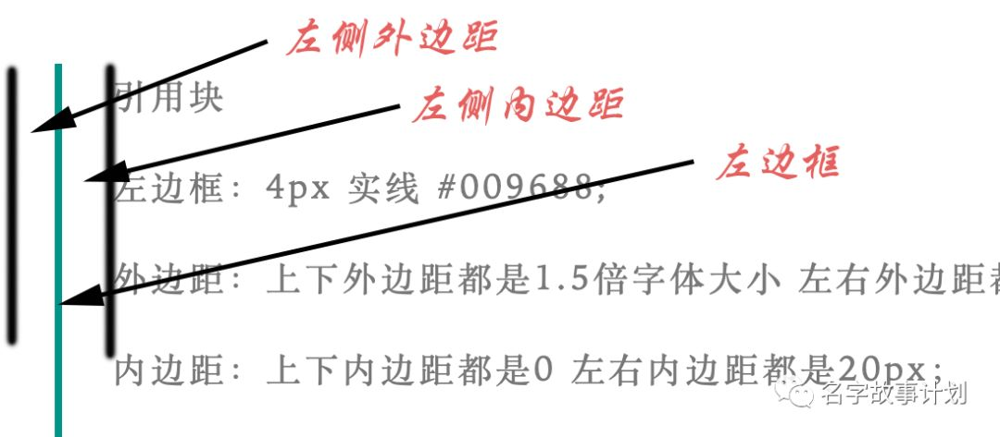

上一篇文章介绍了 [\[Markdown格式写作的优秀软件Ulysses\]](https://mp.weixin.qq.com/s?__biz=MzIzMzg5OTY3OQ==&mid=2247483795&idx=1&sn=20aa62d7f6f99cc8dde5ad7d1e203fcd&scene=21#wechat_redirect) ，在定义排版样式时需要用到css文件，我自己参考了笑来老师公众号排版的css文件。

但对于不懂编程、不会代码的同学，依然不容易看懂里面的代码块究竟是什么含义。这篇文章会针对笑来老师的css文件内容中最重要的几个特征定义，逐行分析含义，另外，给出一些常用的css代码含义。

## 整体配置

> .markdown-here-wrapper {
> font-size: 16px;
> line-height: 1.8em;
> letter-spacing: 0.1em;
> }

Css文件中的代码，

```
{}
```
内的部分是定义规则，
```
{}
```
外的部分是定义的规则所要施加的对象范围，所以，以上代码的含义是：

> 对Markdown here的整体配置
> *字体大小* ：16px；
> *行高* ：1.8倍的字体大小，em指的是相对单位，当前对象内字体的尺寸
> *字间距* ：0.1倍的字体大小

## 强调

> strong, b{
> color: #BF360C;
> }

含义是：

> *强调* ，用粗体显示；
> *颜色* ：#BF360C;
>
> em, i {
> color: #009688;
> }

含义是：

> *强调* ：用斜体显示
> *颜色* ：#009688;

## 水平分割线

> hr
> border: 1px solid #BF360C;
> margin: 1.5em auto;
> }

含义是：

> *水平分割线*
> *边界* ：1px 实线 #BF360C;
> *外边距* ：上下外边距1.5倍字体大小 左右外边距自动

## 段落

> p {
> margin: 1.5em 5px!important;
> line-height: 1.8em;
> letter-spacing: 2px;
> padding: 0em 0.1em;
> }

含义：

> *段落*
> *外边距* ：下上外边距都是1.5倍字体大小 左右外边距都是5px
> *行高* ：1.8倍的字体大小；
> *字间距* ：2px；
> *内边距* ：上下为0 左右内边距为0.1倍的字体大小；

## 引用

> blockquote, q {
> border-left: 4px solid #009688;
> margin: 1.5em 10px;
> padding: 0 20px;
> color: #777;
> quotes: none;
> margin-left: 0.2em;
> padding:0.2em;
> }

含义是：

> *引用块*
> *左边框* ：4px 实线 #009688;
> *外边距* ：上下外边距都是1.5倍字体大小 左右外边距都是10px
> *内边距* ：上下内边距都是0 左右内边距都是20px；
> *颜色* ：#777;
> *引号类型* ：无引号；
> *外边距* ：左外边距是0.2倍的字体大小（可理解为左边框竖线在整个页面的相对位置）
> *内边距* ：上下左右的内边距都是0.2em（其中，左内边距可理解为引用的文字范围左边界距离左边框竖线的距离）如下图所示意。



## 标题

> h1, h2, h3, h4, h5, h6 {
> margin: 20px 0 10px;
> padding: 0;
> font-style: bold!important;
> color: #009688!important;
> text-align: center!important;
> margin: 1.5em 5px!important;
> padding: 0.5em 1em!important;
> }

含义是：

> 一级标题到六级标题的通用属性设置
> *外边距* ：上外边距为20px 右外边距为0 下外边距为10px 做外边距为0；
> *内边距* ：上右下左内边距都为0！优先；
> *字体* ：粗体！优先；
> *颜色* ：#009688!优先；
> *文本对齐* ：居中！优先；
> *外边距* ：上下外边距都为1.5倍的字号大小 左右外边距都为5px！优先；
> *内边距* ：上下内边距都为0.5倍的字号大小 左右内边距都为1倍字号大小！优先；

#### 一级标题

> h1 {
> font-size: 24px!important;
> border-bottom: 1px solid #ddd!important;
> }

含义：

> *一级标题*
> *字体大小* ：24px！优先；
> *底部边框* ：1px 实体 #ddd颜色！优先；

#### 二级标题

> h2 {
> font-size: 20px!important;
> border-bottom: 1px solid #eee!important;
> }

含义：

> *二级标题*
> *字体大小* ：20px！优先；
> *底部边框* ：1px 实体 #eee颜色！优先；

#### 三级标题

> h3 {
> font-size: 18px;
> }

含义：

> *三级标题*
> *字号* ：18px；

#### 四级标题

> h4 {
> font-size: 16px;
> }

含义：

> *四级标题*
> *字号* ：16px；

以上为笑来老师所用css中的主要内容，也是常用样式css的主要内容，其中关于表格的部分没有写出来，是觉得通常公众号文章最重要的是几个级别的标题、强调、引用、分隔线这几部分。

## 注意细节

定义css文件时，一定注意标点符号的格式，用英文格式。

每一级标题中都可以自定义其大小、颜色、位置、行距等等。

用Markdown格式书写文档时，每一段结束时要空一行，这样在公众号编辑器中最终呈现效果 才有段间距。

从Ulysses或其他编辑器中复制Markdown文档到公众号编辑器时，在粘贴之后，尽量先完成全部的后续编辑之后再渲染，后续编辑包括插图、定义超链接等等。
