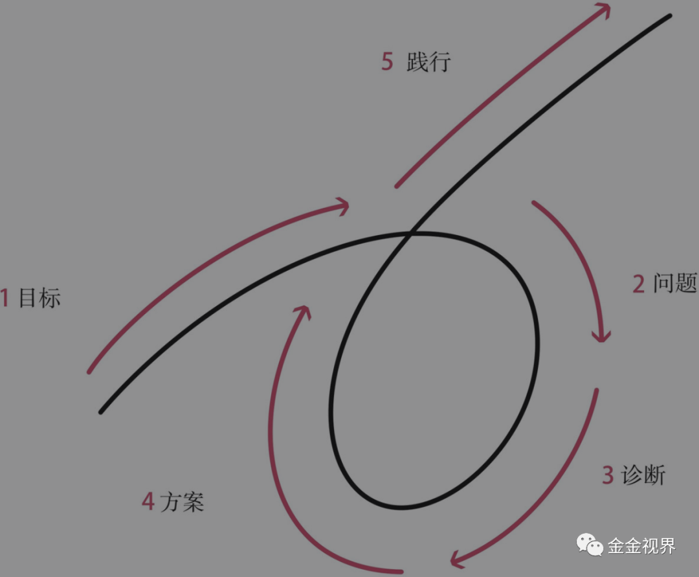

# 成长到底是什么？

金金 金金视界 *2020年6月20日 10:04*

*2020年06月19日 《财富自由之路》第三章—金金笔记&思考*

> 1、如果某个大脑里的某个概念不准确，或者没有准确、正确的定义，那么我们必然没办法思考，由此产生的连锁反应：因为定义不准确，所以思考范围模糊，选择依据缺失，行动方式错误……进而影响整个生活。

**思考**

看到这段话，突然想回忆一下之前几章学的概念都是什么？最重要的概念是什么。

是操作系统，就是指自己的心智。

我们来延伸一个概念“成长”，现在你能否不看任何笔记，然后向你的朋友讲述清楚什么是“成长”吗？

笑来老师说，成长就是自己“操作系统”的升级。

我把这个延伸了下，“操作系统”的两条主线是行动和思考。

成长就是具体的执行这两条主线，行动就是大量阅读，持续输出；思考就是持续总结，迭代自己的行动方法论。

还不够具体。

根据我在《原则》里看到的关于一个人进化过程的阐述，我粗略的写了这个过程，学——做——试错——思考优化——再学——再做——再试错优化。

然后，我又去看了《原则》这本书，看到了达里奥关于“进化”的确切论述，我认为这就是值得我牢牢记忆下来的适用于“成长”概念的定义。

> 个人进化过程通过5个不同的步骤发生：
>
> 1）有明确的目标。
>
> 2）找到阻碍你实现这些目标的问题，并且不容忍问题。
>
> 3）准确诊断问题，找到问题的根源。
>
> 4）规划可以解决问题的方案。
>
> 5）做一切必要的事来践行这些方案，实现成果。

借着这个过程模型，我说一下自己为什么用videoscribe做视频号。

1）目标：做视频号

2）阻碍且不容忍的问题：

出镜会紧张，且现在身材很胖，心理上感觉形象不好；出镜需要购置新的各种设备，注重妆容，状态等非内容本身的东西，加上出镜对我来说不是优势，那宁可没有。

3）问题的根源：

可能有一些自卑的心态，但开始做事本身就脆弱，我应该放弃内生的阻碍，否则容易无法坚持。

4）规划解决的方案：

调查不出镜能否做视频号——可以，笑来老师，剽悍一只猫，刘大猫分享等很多人都没有出镜，以内容取胜。不过我要付出更多的心力和坚持在内容上。

不出镜只出文字的形式是否可行——可以，但是在没有影响力之前，显得相对单调，调查了YouTube上很多知识类的博主用的都是简单的“示意图+文字”的形式，持续做下去，也都做的很好，不过他们是中长视频，和短视频的区别还有待考证，但证实这种形式是可能被人接受的。

具体怎么呈现“简单动画+文字”——用videoscribe，中文的美册app也有类似功能，但作为一款计划长久使用的流程工作工具，我还是使用国外很多博主都推荐的相对专业的videoscribe。

是否面临问题——效率，必然要牺牲一定效率，但这个是可以优化的，一旦固定模式的素材积累足够，可以大大节省时间，刘欣老师建议可以用pr来提高效率，随后抓紧了解和学习。

5）做必要的事去践行，实现成果：

关于videoscribe，本想着直接官网付费购买，发现不支持中文，但官方人员说中文正在开发中，会尽快上线。就去淘了下汉化版本，先用起来。一旦官方汉语版发布，就直接购买，官方有强大的线上素材图库。

然后，就是第一个视频的文案，录音，配画面，直至完稿，发布。

回到“概念”这个话题本身，我正是重新梳理了一遍“进化”的概念，才能清楚的把我思考和行动做视频号这个事情仔细的拆解，之前只是模糊的“大概应该这么做吧”。

至此，关于“成长”这个概念，我会这么讲：

成长就是你操作系统的进化，这个操作系统就是你的心智。

操作系统的两条主线就是思考和行动，相辅相成，相互交织。

**落到具体的场景中，就是“目标——问题——诊断——方案——践行”这个过程的不断循环。**

其中每一个环节的解决都包含了思考和行动。

每一个具体场景的进化完成，都是一次成长。

---

视频号和微信公号二维码，欢迎关注，一起成长进化。

继续滑动看下一个

金金视界

向上滑动看下一个

金金视界