熊市了怎么办——定投依旧是我们大众最合适的方式，今天跟大家交流关于定投的一些思考。

### 一、为什么要分区间定投

**为什么定投：**

> **我理解定投的终极目的，是在某个时间点以前，在风险尽量低的情况下获得尽量多的筹码。**

普通人资金有限、时间有限、试错成本大。 **低成本是控制风险和建立投资信心的关键。**

**为什么分区间：**

> **趋势分周期，周期有顶底，顶底是范围。** 在长期这个条件下，很多指标随着时间的拉长，其表征意义的确定性大大增加，可把握的概率也大大增加。

那么，更多的筹码选择在更好的位置投出去，就变得可以研究了。

既然顶底是范围而非精确的点，那无差别不分周期的定投效率就太低了。剩下的就是怎么判断大致熊市相对低位，以及用尽量少耗费精力、思考的方式买入进去的问题。

**分区间定投的解法：**

- 用多次买入降低风险 → 定投
- 用不同额度在相对低位区域买入 → 分区间

1）判断熊市大致区间

**探索市场的过程，就是追求模糊的正确的过程。正确的模糊范围比精确的点更重要。**

这个过程确实是刻舟求剑，本质就是从历史数据中回测、筛选、整合出一套规则，然后假设未来很可能会重复类似的模式。如果你对此很介意，认为历史不会重演，那可以略过。

这里结合了均线、链上数据（综合MVRV-Z、RHODL、年度已实现利润/亏损、链上成本结构）做了一个类指数类的评分体系，后面有详细解读。

2）怎么买

从看到做完判断，到落地执行，有很长的过程。我有看到，过往社群里，每次熊市大底的时候，绝大部分人，是连定投都停了的，没有信心的，死寂沉沉一片。

**量化让策略落地：**

从判断到执行，中间是量化（是指阶段化、数据化），越清晰，执行过程中需要的二次思考越少，落地程度越高。

如果没有量化的策略，感性占主导，结果一定是高位不敢卖、低位不敢买。用数据让理性战胜感性，把”敢不敢买”变成”系统让我买多少”。

> **好的量化后的策略就像一个包含了不同尺子的工具箱，在市场里，它丈量时间，也丈量空间，它记录周期，也感知位置。**

以上是不断思考和优化的结论，那么回头看一开始我自己为什么一直琢磨这个呢？

**琢磨分区间定投的出发点：**

1）我无法做到少数几次就完成购买，这会消耗很大的心力，操作时候的压力也大

2）无法精确的判断那最好的位置，以及最好的位置会不会出现，没有这个能力

3）我认为定投是可以优化的

事实证明，前两个周期，这个买入策略，让我在执行上，很丝滑

### 二、多维度评分体系

#### 2.1 维度说明

维度 ： **均线位置** 、 **MVRV Z-Score** 、 **RHODL Ratio** 、 **已实现盈亏比** 、 **成本结构**

这步其实挺主观的，就是经过回测和筛选后，自己判断，哪些指标你可以用，过往有九神估值这个维度，这次优化移除了，原因见文章【链接】。不排除以后继续优化，不断的“刻舟求剑”。

如果觉得复杂，【分区间定投看板】暂时放在了这里http://8.216.6.8/，如下图：

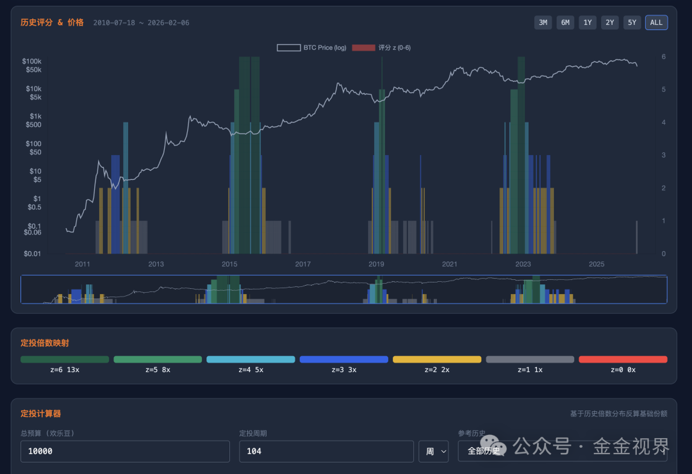

#### 2.2 指数到定投倍数的映射

价格在这个多维度体系当中，处于不同的位置，会显示出不同的指数，对应不同的适合定投的倍数。

指数z—— 0～6 → 对应定投倍数：0、1、2、3、5、8、13

定投倍数的排列就是斐波那契数列，为啥，觉得是相对平衡的节奏。

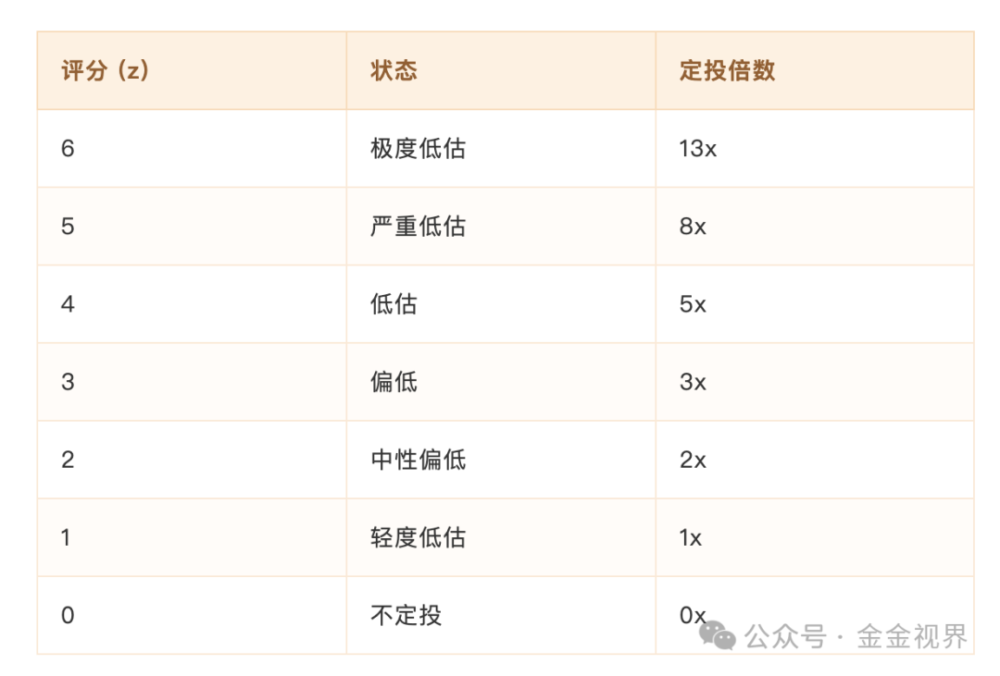

### 三、过往验证

#### 3.1 记录（2019-2020）

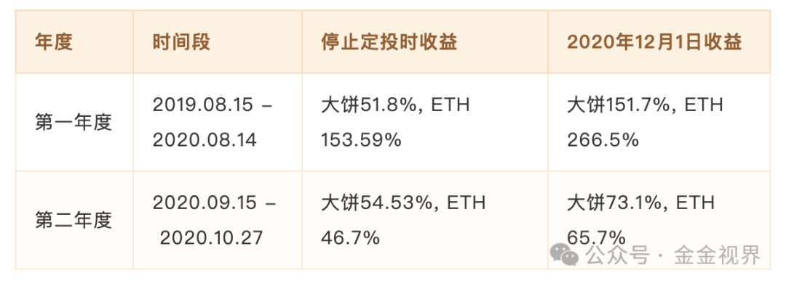

**相比等额定投，分区间定投不仅仅提高了近 20 个点的收益率，更重要的是在低位加了足够筹码。2019-2020 年度，一共投出了预定份额的 150% 的量。**

> 只有拿到足够多的低位筹码，在价格涨上去的时候，才不会被大波动影响心态，相当于早早的给自己在量和价上都建立了一道护城河，也就是证券分析之父本杰明·格雷厄姆所说的 **安全边际** 。

#### 3.2 312

赶上 2020 年的 312，在社群里一边加油打气，一边鼓励让大家 10 倍、8 倍份额购买，随着行情越来越好，变成了 5 倍、3 倍、2 倍的买。

22年6月到10月也是同样的状态。

即使这样，我知道很多人并没有跟随策略，而是停止了定投。因为那种恐慌情绪下，下跌过程中，顶住越投越亏的直接反馈太反人性了。

以上是老版的体系，最近进行了优化。

### 四、历史回测验证的一些经验（Cycle 2-4）

以下数据基于 大饼三轮完整周期的回测（周期定义为 ATH → ATH）。

#### 4.1 熊市很长，不要急

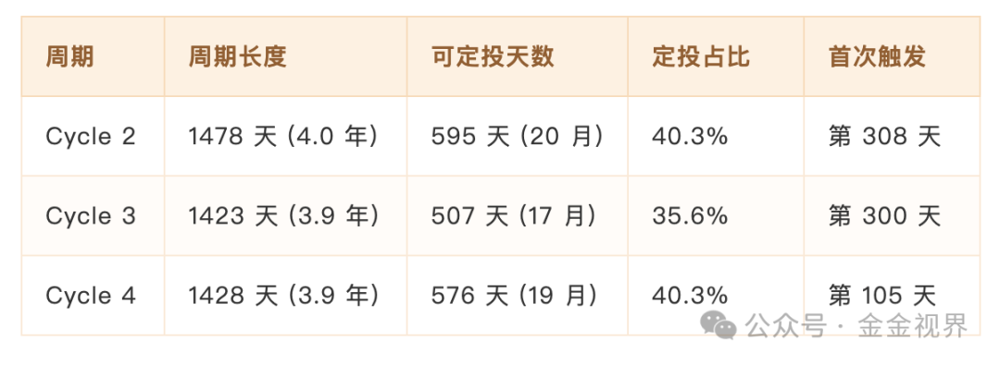

**按照这个体系回测，过往几个周期，一个完整周期约 4 年（如果你认为也还有效的话），可定投窗口 17-20 个月，占比 35-40%。**

#### 4.2 即使没有极端底部，也能投入很多

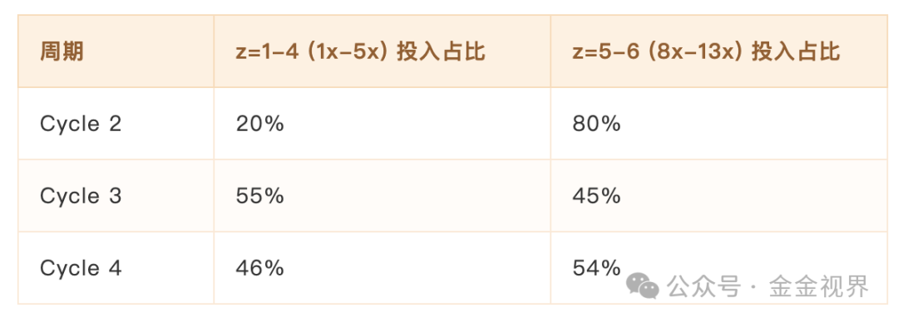

Cycle 3 极端底部很短（13x 只有 26 天），但通过 1x-5x 的中等低估区间，仍然投出了 55% 的资金。

#### 4.3 不会错过最低点

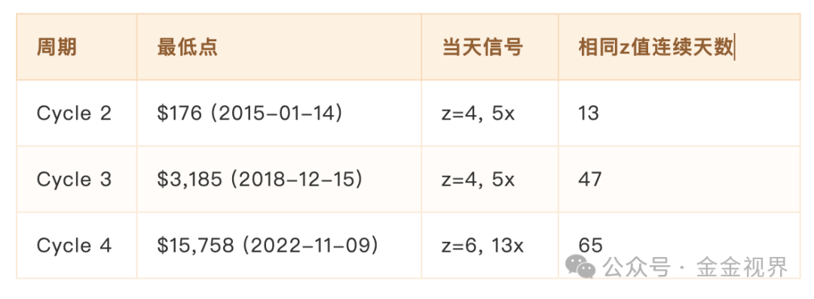

**最低点同级别区间，都有机会买入。**

#### 4.4 最熊的时候，系统给出最高信号

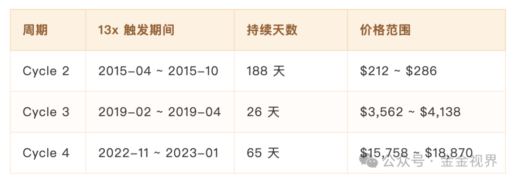

### 五、收益对比

假设条件：

- **总预算**
	：$100,000
- **周期天数**
	：365 天
- **期望倍数**
	：1.5（基于历史分布）
- **基础份额**
	\= 100,000 / (1.5 × 365) = **$182.65**

#### 5.1 固定预算模式

投入总预算 $100,000，投完就停。

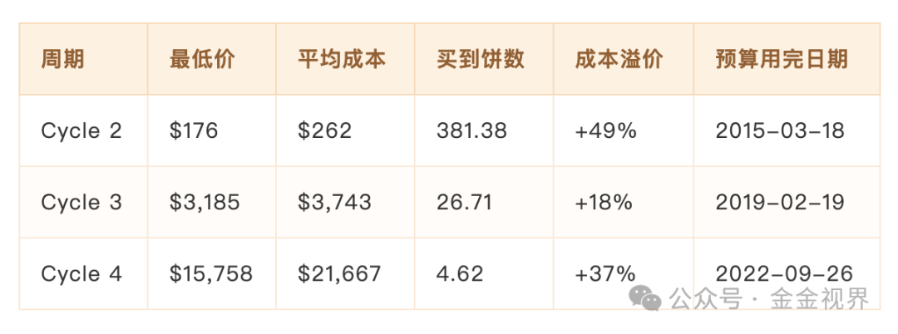

#### 5.2 固定份额追加模式

使用相同基础份额 $182.65， **只要 z ≠ 0 就持续投入** （不设预算上限）。

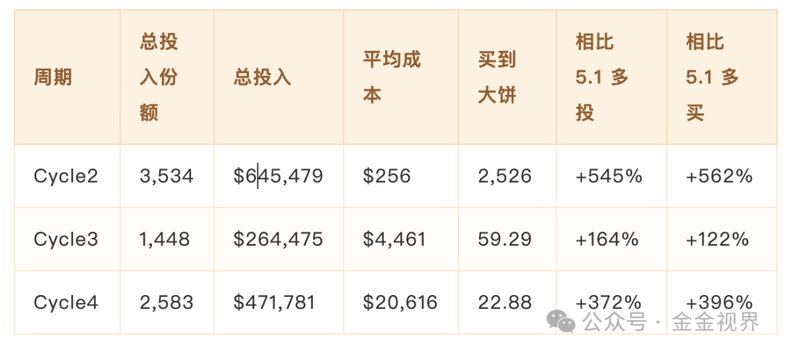

#### 5.3 两种模式成本对比

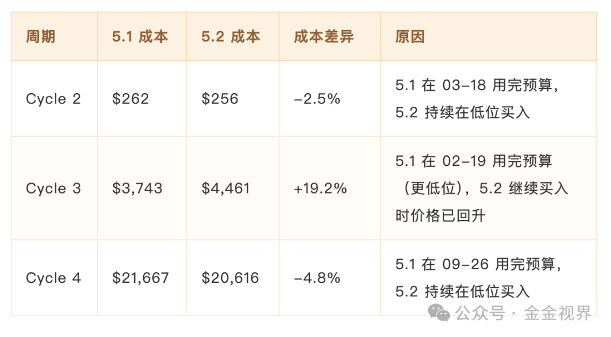

**解读** ：

- 两种模式的成本 **不同** ，取决于预算用完的时机
- 5.1 预算用完后就停
- 5.2 模式的特点在于投入了更多 **买入更多大饼** （+122% ~ +562%），即使成本略高也能获得更多筹码

实际上，提前投完，没投完，这两种都有可能碰到，但仔细想想，都是可以接受的。

### 六、执行方式

#### 6.1 日常操作

1. 打开看板（每天/每周看一次即可）
2. 看到当前倍数（0x-13x）
3. 按倍数执行定投

**不需要：**

- 判断”是不是底”
- 看 K 线、盯盘
- 研究技术分析

**把复杂的市场判断交给系统，你只需要按提示执行。**

#### 6.2 数据来源

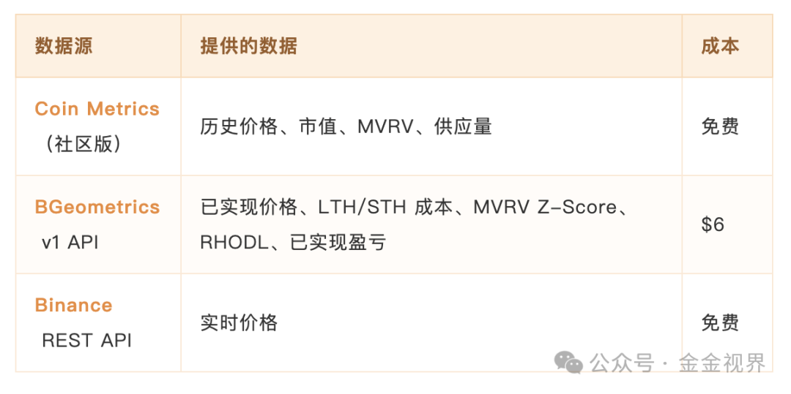

分区间定投看板每天自动从 BGeometrics 拉取链上数据更新，每 5 分钟从 Binance 刷新价格。

这片文章中的数据拉取和回测都是Claude Code完成的，感谢AI，让我们的效率提高和辐射范围大大增加。

### 七、常见问题

**Q: 策略适合什么样的选手？**

我自己在用，也适合大部分普通选手，只要在相对好的位置，慢慢定投就好了。

但要注意，因为本身定投的时间，就很久1年左右，也就意味着这笔钱起码两三年是预设不动的，所以不用杠杆，不借贷等等基本原则一定注意。

**Q: 为什么不用九神指标（ahr999）了？**

ahr999 依赖的幂律模型增速假设过高，随着 大饼市值增长，振幅收窄，区分牛熊的能力已经衰减， [详见](https://mp.weixin.qq.com/s?__biz=MzIzMzg5OTY3OQ==&mid=2247484216&idx=1&sn=5fc8a8f0e94a5395c61d3c582c5eada4&scene=21#wechat_redirect) 。 `   `

**Q: 如果这轮没有极端底部怎么办？**

Cycle 3(2020) 就是例子——13x 信号只出现了 26 天，但通过 1x-5x 的中等低估区间，仍然投出了 55% 的资金。系统设计保证了即使没有极端底部，也能把钱花出去。

**Q: 我要准备多少资金？**

两种策略（详见第五部分）：

1. **固定预算模式**
	：设定总预算，计算基础份额 = 预算 / (期望倍数 × 周期天数)，投完就停，这部分可以参考分区间定投看板【http://8.216.6.8/】的定投计算器，输入就能看到结果。
2. **固定份额追加模式**
	使用相同基础份额，只要z ≠ 0 就持续投入，总体能以还可以的成本买入更多。

**Q: 多久看一次？**

每周看一次足够，每日也可以，相对低位的那些区间通常持续数月，不会因为错过一两天而踏空。

**Q：现在市场是什么阶段？**

用这个体系去套，自动显示，当前处于进入熊市可以刚刚开始以定投指数z=1，1倍买入的时间段，也说明是开始进入熊市相对低位的时区间了。

### 八、缺点

1.刻舟求剑的本质局限

每个维度中条件设定或者阈值选取，都是依据过往数据拟合后的的出的，也可能有过度拟合的风险

假设”历史会重演”，但市场结构在变化（ETF 进入、机构主导、监管成熟）

九神指标的失效就是前车之鉴——当前有效的指标未来也可能衰减

2.周期假设的脆弱性

假设 4 年周期继续有效（绑定减半）

如果周期拉长到 5-6 年或缩短到 2-3 年，策略怎么样，还不知道

---

这是继2020年12月份阐述 [分区间定投体系](https://mp.weixin.qq.com/s?__biz=MzIzMzg5OTY3OQ==&mid=2247484096&idx=1&sn=b8596f1adbe4e4b4f2aa621d952d4353&scene=21#wechat_redirect) 以来，第一次进行优化，本质上是一个基于历史规律的纪律框架，解决的是”什么时候买的判断、以及买多少的执行”问题。

我认为体系的价值不在于预测未来，而在于用规则战胜情绪。缺点是真实存在的，接受这些局限性是使用它的前提。

也是提供一个思路，每个人都可以建立自己的体系，哪怕只用一个维度，去丈量和判断，去指导操作，也肯定比纯感性要好。

综上，仅供交流，片面之处，欢迎指正。
