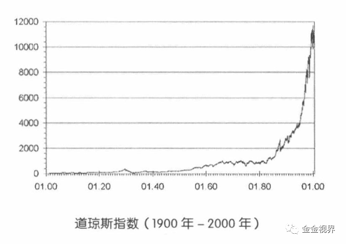
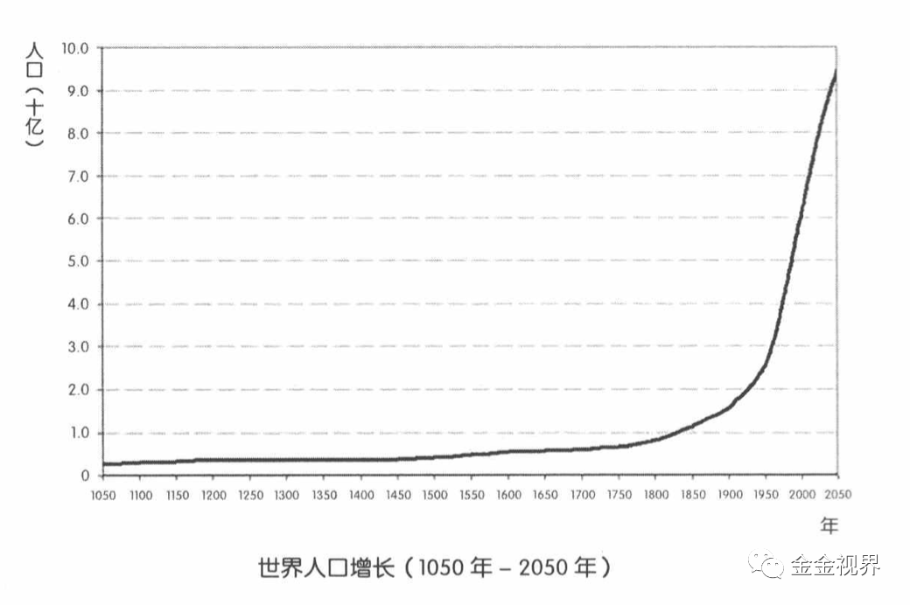
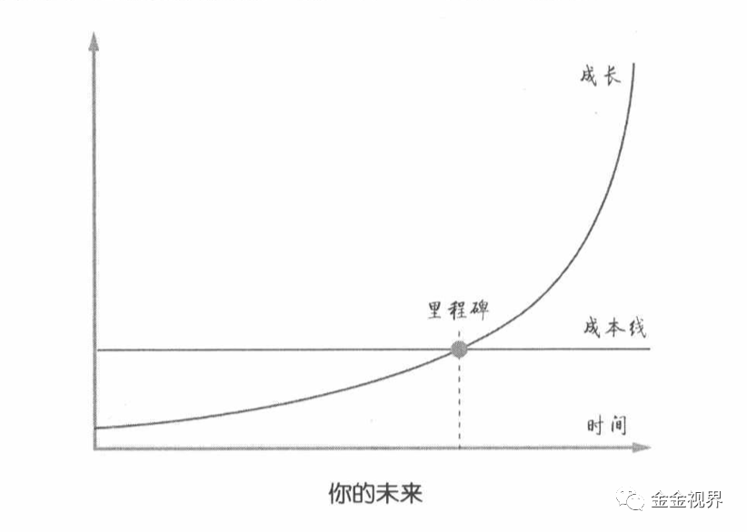

# 为什么知道跑步有益，还是无法动身？

金金 金金视界 *2020年6月18日 23:25*

*2020年06月18日 《财富自由之路》第二章—金金笔记&思考*

> 1、借钱的时候，人们不愿意支付利息，原因也很简单：事情哪怕只复杂一层，就完全无法理解，更别提复杂一层以上了。

**思考：**

**类似“行动的达成路径”，越短越容易实现** ，如果你跑步，可以去坐两站地铁才能达到的健身房或者家旁边的操场里，那么你很可能更多的是在旁边的操场跑，因为去健身房你要考虑形象、装备，还要坐地铁或者开车。

就像机械传动一样，每多一个齿轮传动，就多一次摩擦耗能，传递下去的有效动力就降低一部分。

为了尽可能缩短这个距离，我自己在家里买了跑步机，站立式办公桌，这是硬件。

但即使这样，也不一定就有动力每天跑，还要解决思维上的路径，为了能每天都主动去跑步，我买了iwatch手表，上面有记录每天运动量的目标圆环，我如果一抬手发现，目标圆环还没有闭合，那我就能立即摆好电脑，站立式办公，同时开始快走，知道目标达成。

有记录可查的，我现在已经持续了将近一个月。如果想一起每天跑步的小伙伴，也可以找我，我们组团，每天相互督促。

相反， **如果某件事无益，但你又特别想做，那就要事先切段做到这件事的路径** ，比如阅读时，把手机静音放另一个屋子里。

我自己曾经玩游戏就是这样，另一台笔记本windows的，里面装了最喜欢的dota游戏，时不时的总想打开玩玩，因为及时反馈更强烈，多巴胺分泌更多，为了解决这问题，我把游戏卸载，把这台笔记本让别人用了。之后再也没玩过游戏。

**思维也是一样，复杂一层，主观上也不愿意去主动思考。**

而大众下意识不愿意去做不愿意去思考的的，大多是值得做的值得思考的。

主动思考，具体来说就是把概念进行不断的延伸和链接，这样形成的新的观点就是你独特的原创，这个方法推荐看“李叫兽”公众号，很实用。

> 2、继承资产的好处，是让人可能在很早的时候就理解利息的原理和复利的神奇力量。我几乎从未从金钱上获得过复利的神奇力量的支持——因为我没有任何可继承的资产。35岁之前，我的资产还总是反复清零。
>
> 万幸且公平的是，在智力上、知识上、经验上、复利效应对每个人来说都是存在的。
>
> 只要是积累的东西，大都会产生复利效应。
>
> 如果没有资产可继承，那就积累知识吧。

**思考：**

恰恰因为资产能够让人最直接的感受到复利的神奇，而大多数人是没有资产继承的，所以大多数人，都无法感受到复利的力量。即使后来体会到了，那也是其他方面做的成功，获得了资本。

我们大多都是普通人，没有资产的人，也不用为此而着急。

所以，你我所要专注的就是在知识上、智力上、经验上的积累。

> 3、一切有意义的成长过程都符合那个形状的曲线，起初看不出太大斜率，一旦过了某个时间点，曲线就会极速上扬，即有拐点的、突破了成本线的、后端极速上扬的“复利曲线”

股市增长、人口增长也是这个曲线。（图片来源：《财富自由之路》）

持续的学习，才能有机会在自己的未来体会到复利效应。

**思考：**

学——做——试错——优化——再学——再做——再试错优化，这个过程也符合《原则》里的成长过程。

而这个过程，和基因与继承财产等客观因素无关，只与自己是否愿意持续学习、持续行动有关。

在移动互联网时代，比如微信这个平台，现在几乎是全阶层覆盖，对个体来说，不管是倒逼自己进步、找到同频的人还是输出有价值的东西影响别人，跨越拐点都更为重要。早一步开始积累，几年后看，可能结果差别很大。

> 4、自信
>
> 有的人格外自信，是因为他们一直在搜寻自己的“复利增长曲线”——并且可能已经找到了——所以他们才会那么淡定，那么从容，才会在种种所谓“逆境”中依然保持乐观。

**思考：**
这点无比重要，现实中我们所看到的做出成绩的人，几乎都经历过极度困难和绝望的境地，而自信，能够自我激励，是跨越低谷的关键。

笑来老师说要“盲目自信”，我理解更多的是让你我忽视前进过程中那些负面的东西，“嘲笑、讽刺和否定”，这些“泼冷水”式的存在，是成长的巨大障碍。 **有同行者的鼓励最好，但最重要还是孤独的“自信”** 。

前天开始日更公众号，第二天就发现关注少了两个人，因为本身关注就一百多个人，很少，心里面还是挺不舒服。但后来想清楚，所有的现状都符合我的能力，别人认为我输出的价值不够，那取关很正常，我要做的是继续大量阅读和实践，慢慢输出我认可，也有其他人认可的内容。

所以自信，更多是要让自己专注于自己的事情。

---

欢迎扫码关注视频号和公众号“金金视界”，或加微信jinvlog交流，一起行动，一起输入和输出，探索高效的升级路径。

