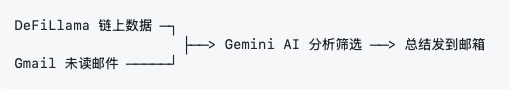
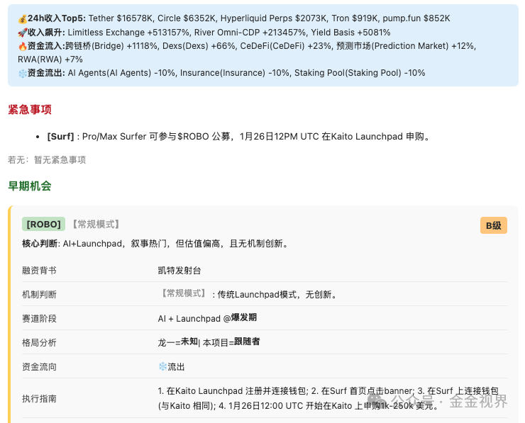

#### 核心流程

**四步：**

1. **拿链上数据**
	：去 DeFiLlama 看哪些赛道资金在流入/流出，作为参照
2. **读邮件**
	：拉取最近 24 小时的未读邮件（最多 30 封）
3. **AI 筛选**
	：按我设定的偏好过滤，生成结构化 HTML
4. **发送**
	：总结自动发到邮箱

#### Prompt 设计思路

这部分见仁见智，我的思路就三点：

1. **定义角色**
	：告诉 AI「你是谁、我是谁、我要什么」
2. **设计筛选标准**
	：我关心什么维度，就让 AI 按这些维度判断
3. **规定输出格式**
	：固定 HTML 结构，每天总结长得一样，扫一眼就知道重点

你关心宏观就让它提取宏观观点，关心热点项目就让它筛人气高的，按需调整。

这部分的一个建议就是，问它当前github或者网络上有没有更好的提示词框架。

#### 都用了什么

部署方式：用 cron 定时任务，每天早上跑一次。

| 项目 | 说明 |
| --- | --- |
| Gmail 应用专用密码 | Google 账号设置里生成 |
| Gemini API Key | Google AI Studio 申请 |
| Python 3.8+ | 运行环境/跑在了云服务器 |

脚本，直接让Claude Code完成，直到迭代正确跑通，Claudecode的强大另外再说，单强烈建议体验。

#### 效果和局限

**效果** ：每天 5 分钟看完，心里有数。确实捞出了几个之前埋在邮件里没注意的有用信息。今天给我推荐Openmind，参与了一点。

**局限** ：只能处理纯文本，看不了图片和附件；Prompt 需要持续调优；只是第一层筛选，不能替代深度研究。

#### 写在最后

这个工具不复杂，但对我来说，它解决了一个真实痛点： **把邮件的信息过载变成信息流常态** 。

这也是我做这个系列的初衷，一定要和自己的真实问题结合起来，顺便把 AI 和代码学了。

费曼说：「如果你不能简单地解释它，说明你还没真正理解它。」

下一期「我的AI工具箱」，我们继续造。

---

*有在用 AI 自动化的场景的伙伴，欢迎留言交流。*
