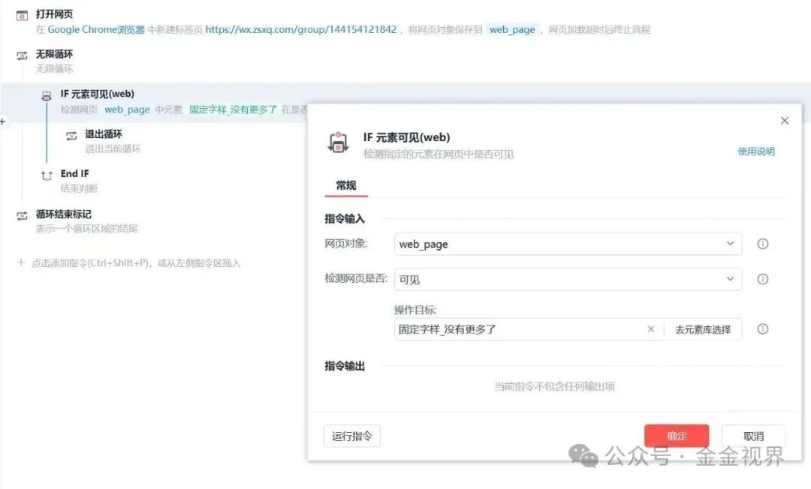
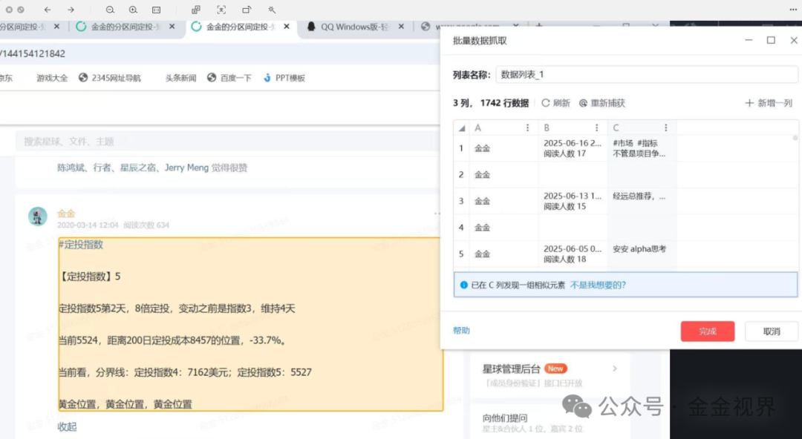

前段时间，我开始整理自己在知识星球上发布过的内容，想交给 AI 帮我分析和归类。

但 **知识星球不支持内容导出，也没有开放 API 接口** ，几乎只能手动复制粘贴。

而过往几年的帖子已经积累了几千条，手动保存效率低，还易出错。最近接触到一款自动化工具—— **影刀** ，参考教程学习和摸索之后，搭建了一个抓取流程。

今天，就把这个流程详细分享出来，如果你也想把星球内容备份下来，这篇应该对你有用。

✳️ 影刀是什么？

影刀是一款 **零代码自动化办公软件** ，可以模拟人对网页的操作，比如点击、滚动、输入、复制粘贴等。它就像一个可以被编程的“数字助理”，适合处理网页上的大量的重复性任务。

你可以在影刀官网下载并注册账号。安装完成后，新建一个流程应用，就可以开始搭建了。

📄 我的知识星球抓取流程（全图解）

> 👇下面是我完整流程截图，一步步讲解设置逻辑：

---

① 打开网页

在流程第一步中设置自动打开浏览器（建议使用 Chrome），并跳转到你的知识星球主页。

---

② 滚动加载全部内容

知识星球是“无限下拉”结构，需要加入一个循环，让页面不断往下滑，直到加载出所有内容。

如何判断“加载完成”？用一个 IF元素可见 判断页面是否出现“没有更多了”这几个字。

记得要在“元素库中选择”，弹出窗口后，ctrl+鼠标点击“没有更多了”这个元素，点击确认

---

③ 设置持续下拉动作

为了配合上一步，这里补充设置持续滚动动作，直到触发停止条件。

---

④ 判断是否有“展开全部”

很多帖子篇幅较长，初始是折叠状态。你需要设置一个判断：如果当前帖子有“展开全部”的按钮，就执行点击。

---

⑤ 点击展开全部

在判断成立的条件下，添加点击动作，展开完整内容。

---

⑥ 批量抓取数据

所有帖子内容加载并展开后，开始批量提取数据。建议提取字段包括：

作者昵称、发布时间、正文内容

 

---

⑦ 将抓取结果合并为文本

将提取到的内容拼接为一段纯文本，每条记录用换行隔开，变量名设为 joined-text。

---

⑧ 写入本地文档

最后一步，把 joined-text 内容写入到本地文本文档中。你可以提前创建一个.txt 文件（比如叫“知识星球1.txt”），流程就会自动写入内容。

---

💡 补充说明

整个流程搭建下来，大概需要半小时到一小时。影刀的界面比较直观，流程也能不断调试调整， **关键是每一步都先测试好再往下接** 。

过程中难免会遇到小问题，比如元素选择失败、页面未完全加载等，保持耐心，一定可以解决的。

📩 模板领取
希望之后可以把更多实用工具、流程优化和 AI 应用的思路慢慢分享出来。

👉 你有用影刀自动抓过哪些内容吗？欢迎留言交流。
