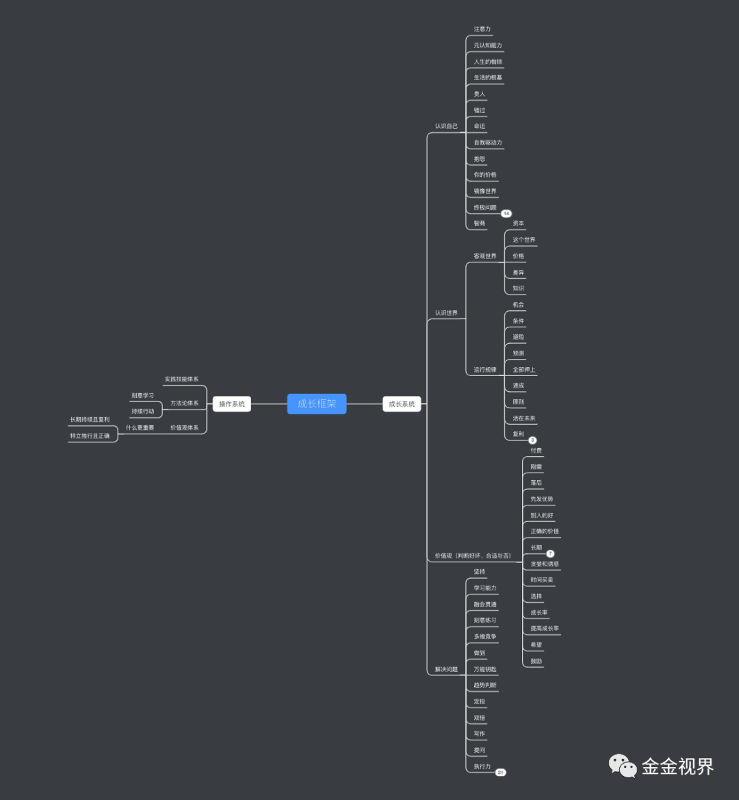
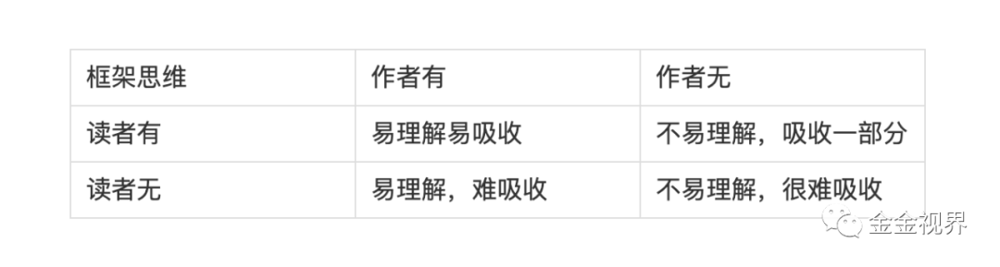

# 为什么学了那么多概念和方法却用不上

原创 金金视界 金金视界 *2020年8月5日 11:17*

#### 学到的知识用不上

最近又读了一遍李笑来老师的《财富自由之路》，里面有很多启发性的概念、价值观和方法论。

但不知你有没有一种感觉，读完就忘，读的时候都觉得很深刻，但回忆起来、执行起来，觉得对不上，甚至过一段时间都忘记了。

看似有了知识获得，实则散乱无章法，不能指导行动。

先来看求知的目的。

#### 求知的目的

> 要么追寻内心，要么追求成长。

现阶段的绝大多数人，应该都是后者，这更有实际意义，目标明确，增加知识就是为了更好的成长。

那成长是什么呢？

我理解就是看待问题和解决问题的能力变强。

在达里奥的《原则》里，他定义了“进化”这个概念，基本是和成长一个意思。

他说进化的过程就是：明确目标——找到阻碍目标的问题——找到问题的根源——找到解决问题的方法——做一切必要的事来践行这些方法。

这是很具体的解决问题的过程。

但往往，我们在解决问题之前，都有一个认识和理解问题的阶段。

#### 解决问题，先理解“环境”

老喻说，个人就是一台车，现实是一片烂泥地。真正理解了环境，拖拉机未必比法拉利跑得慢。

因为几乎解答所有的问题，都得“看情况”，即都有环境、有条件，它们属性不同，特点不同。认识“环境”，明确条件，区分属性，才能真正理解问题。

这是横在实际问题和学到的知识之间的一个障碍，跨越它，才能将知识和问题联系起来。

#### 个人成长知识框架

我们面临的问题，可以归结为三大类，自己是怎样的，社会是怎样的，个人和社会之间的关系是怎样的。

即认识自己和认识社会，再加上自己的判断、选择和行动，就构成了 **个人成长的知识框架** ：

认识自己、认识社会、判断好坏和取舍、如何解决问题。

**认识自己** ：自己是什么样的，单个人的属性是什么。

**认识社会** ：包括客观世界、社会运行规律、自然规律

**判断好坏、取舍** ：价值观

**如何解决问题** ：行动和反馈

##### 通常面对知识内容易陷入的误区：

**只收藏，无归类；**
**只输入，不整合；**

##### 建立个人成长的知识框架有这几点作用：

1、可以判断自己在哪方面是欠缺的，针对性去补

2、遇到新的知识，知道它是属于那个方面的，促进知识的系统化和链接创新。

3、意识到解决问题的流程（确认答案的目标范围）

有了这个框架，再去读书，就知道这本书是哪个范畴，是帮我认识自我，还是了解客观世界，是某种变化规律，又或者是某种技能（解决问题）。

深入到某本书里面，面对不同的概念，也是同样的道理，明确能起到什么作用。

就像盖房子，你知道房子是什么样的，才知道水泥怎么用，砖头怎么用。

比如，二八法则，羊群效应，这是认识社会规律的。

不要和垃圾人纠缠，这是判断好坏且在如何解决问题的范围内。

长期主义，一个是理解事物发展规律，一个是如何解决问题。

“特立独行且正确”，这就是概念的链接得出的观点。属于如何解决问题这个点，“正确”是方向对，“特立独行”是容易出头。

有了框架思维，就可以针对性的把《财富自由之路》的众多概念归类。

这是我针对《财富自由之路》这本书做的一个归类，大家可以根据自己的理解判断和分类：

在本书中，笑来老师给出的基本框架是：操作系统——概念——概念之间的联系，贯穿这个框架的是，价值观和方法论。

对概念的解读、判断和选择，是价值观。

对概念以及概念之间联系的践行，是方法论。

比如笑来老师最为推崇的“什么最重要”这把刀。

是最重要的价值观，也导致了最高效的方法论。

比如在以下几个方面的应用：

> 择偶，最重要的是“对方是不是一个能讲道理的人”
>
> 带团队，最重要的是选一件发展迅速的事情去做
>
> 投资，最重要的是买到可维持长期成长率的可增值资产之后，一直握着不动
>
> 自己，最重要的是对自己负责
>
> 价值增长，最重要的是成长率

操作系统这个框架，更加针对知识的发散和延伸。

而成长知识框架，重点在于知识的归纳和吸收。

二者结合使用，更有用。

最终，在接收信息的时候，能判断它是不是知识，如果是知识，属于那个方面，能够解决我们的什么问题，能够延伸和扩展到哪些其他方面。

#### 框架思维之于作者和读者

我们吸收知识，也输出内容，即是接受者，也是创作者。

如果你看到一个人的内容之后，感觉很杂乱，过后没印象，用不起来，有两种可能，一是对方输出的没有框架思维，二是自己没有把知识归纳进自己的知识框架。

从下表可看出读者和作者分别有无框架思维，形成的不同的组合带来效率的差异：

为了更高效的学习，自己要做一个有框架思维的读者，同时要尽量看那些有框架思维作者的作品。

为了更能让受众接受，作为内容输出者也要做一个有框架思维的作者。

有了框架思维，才知道学的是什么，可以用在哪儿。

就像多年来，你在电脑里收藏存储的文件，存的时候没有重新命名和归类，需要的时候，就是很难找到。
